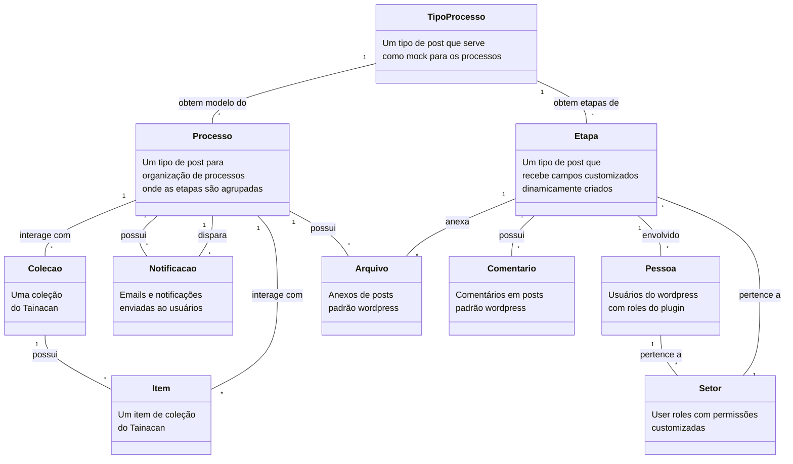

# Obatala: Plugin de Gestão de Processos Curatoriais para WordPress

"Obatala" é um plugin avançado para WordPress que estende as funcionalidades do Tainacan, uma plataforma renomada de gestão de coleções digitais. Especialmente projetado para museus e instituições culturais, Obatala oferece uma solução integrada para a gestão eficiente de processos curatoriais.

## Descrição

Com "Obatala", os museus podem gerenciar todo o ciclo de vida de suas exposições e coleções, desde o planejamento e a organização até a execução e a análise de resultados. O plugin facilita a catalogação detalhada de obras, a montagem de exposições, e a colaboração entre curadores, artistas e outros profissionais da cultura.

Obatala também aprimora a interação com o público, proporcionando ferramentas que permitem criar experiências culturais mais ricas e envolventes. A integração com o Tainacan garante que as informações sejam armazenadas de forma segura e acessível, com suporte para metadados ricos e flexibilidade na gestão de dados.

Ideal para instituições que buscam inovar na apresentação e gestão de suas coleções, "Obatala" é a escolha perfeita para transformar a curadoria em uma experiência dinâmica e integrada, honrando o legado criativo e justo da divindade Obatalá.

## Funcionalidades

- **Gerenciamento de Processos e Etapas**: Criação e edição de processos curatoriais com múltiplas etapas.
- **Metadados Dinâmicos**: Adição e configuração de metadados personalizados para cada etapa do processo.
- **Gestão de Setores**: Agrupamento de usuários em setores, com permissões específicas e atribuição de setores às etapas do processo.
- **Interação com Processos**: Usuários podem adicionar comentários e mudar o status das etapas.
- **Notificações**: Envio de notificações por email e na interface de administração quando o status do processo mudar.
- **Integração com Tainacan**: Anexação de itens e coleções do Tainacan aos processos, com verificação do histórico dos itens.

## Visão geral da estrutura do plugin

## Documentação

A documentação completa do plugin está disponível no diretório `mk-docs` e pode ser acessada online no seguinte link: [Documentação Oficial](https://nocs-lab.github.io/Obatala/).

## Colaboração

Se você deseja colaborar com o desenvolvimento do plugin Obatala, siga os passos abaixo:

1. Faça um fork deste repositório.
2. Crie uma nova branch com a sua feature: `git checkout -b minha-feature`.
3. Commit suas mudanças: `git commit -m 'Adicionando minha feature'`.
4. Faça o push para a branch: `git push origin minha-feature`.
5. Abra um Pull Request.

Para discutir ideias e tirar dúvidas, junte-se ao nosso Slack: [Tainacan Slack](https://tainacan.slack.com/).

## Licença

Este projeto está licenciado sob a Licença GPLv2 ou posterior.

---

Este projeto é um addon do Tainacan, uma plataforma de gestão de coleções digitais, e visa estender suas funcionalidades para uma gestão eficiente de processos curatoriais.
