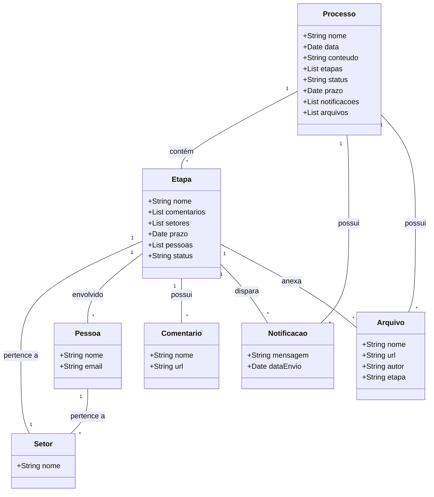
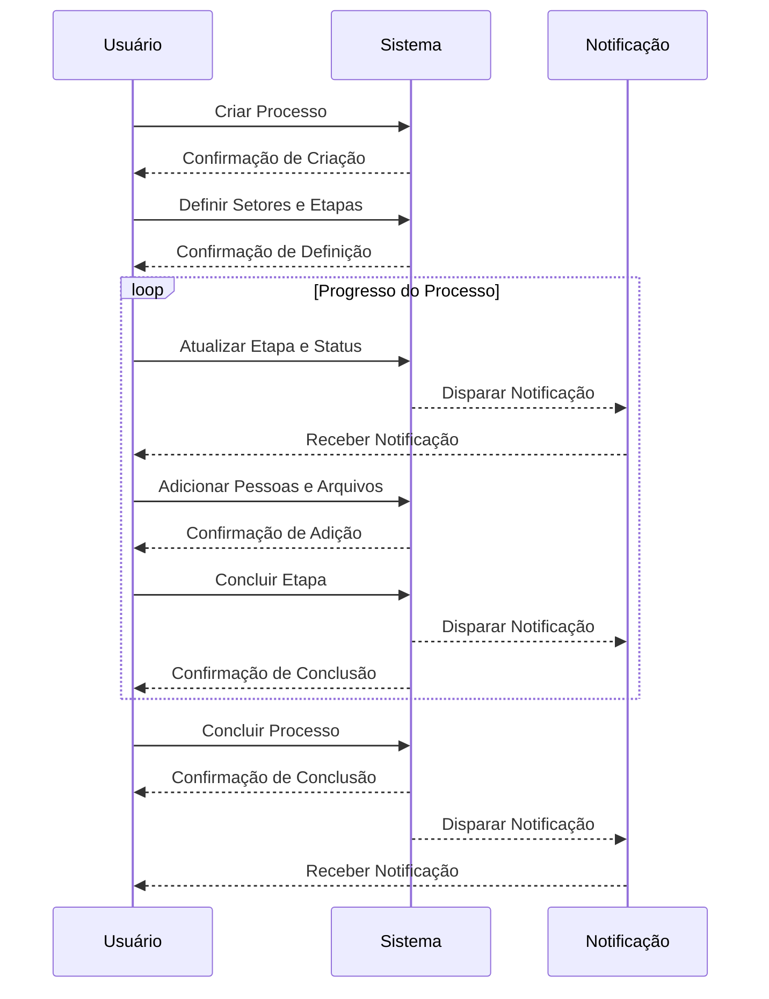

### Documento de Modelagem de Processo Atualizado

Este documento descreve a modelagem de um processo como uma entidade dentro do WordPress, utilizando o post customizado `process_collection` e as taxonomias `process_step` e `process_type`. A seguir, detalharemos as propriedades da entidade `Processo` e utilizaremos diagramas Mermaid para ilustrar tanto a estrutura do processo quanto a sequência de um processo típico.

---

### Entidade: Processo

#### Propriedades do Processo:
1. **Nome (Title)**  
      - Identificação única do processo.
   
2. **Data (Date)**
      - Data de criação ou início do processo.
   
3. **Conteúdo (Content)**
      - Descrição detalhada do processo.

4. **Etapas (Steps)**
      - Fases ou passos do processo, incluindo comentários, setores, pessoas, status, e notificações associadas.

5. **Status**
      - Estado atual do processo (ex: Iniciado, Em Progresso, Concluído).

6. **Prazo (Deadline)**
      - Data limite para a conclusão do processo/etapa.

7. **Notificações (Notifications)**
      - Alertas ou avisos relacionados ao processo.

8. **Pessoas (People)**
       - Usuários ou grupos de usuários envolvidos no processo.

9.  **Arquivos (Attachments)**
        - Documentos ou arquivos relacionados ao processo.

---

### Estrutura do Processo

---

### Sequência do Processo

### Explicação dos Diagramas:

1. **Estrutura do Processo**:
      - **Processo**: Entidade principal que representa o processo com suas várias propriedades e associações.
      - **Setor**: Representa os departamentos envolvidos.
      - **Etapa**: Fases ou passos do processo, incluindo status, setores, pessoas, comentários, e notificações.
      - **Notificação**: Mensagens enviadas durante o processo.
      - **Pessoa**: Usuários ou grupos envolvidos no processo.
      - **Arquivo**: Documentos relacionados ao processo.
      - **Comentário**: Observações e discussões associadas a cada etapa.

2. **Sequência do Processo**:
      - **Usuário** cria um processo.
      - **Sistema** confirma a criação do processo.
      - **Usuário** define os setores e etapas do processo.
      - **Sistema** confirma a definição dos setores e etapas.
      - **Usuário** adiciona pessoas e arquivos ao processo.
      - **Sistema** confirma a adição.
      - Durante o **Progresso do Processo**, o **Usuário** atualiza a etapa e o status, e o **Sistema** dispara notificações.
      - **Usuário** conclui o processo e o **Sistema** confirma a conclusão.
