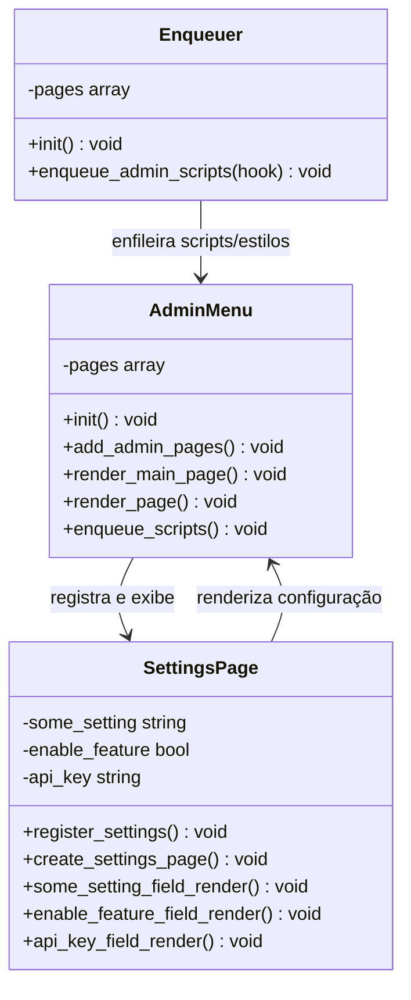

# Documentação do Plugin

## Visão Geral

O plugin foi desenvolvido para gerenciar funcionalidades administrativas e de interface dentro da plataforma WordPress. Este documento detalha as classes principais que compõem o sistema, como `AdminMenu`, `Enqueuer` e `SettingsPage`, explicando suas responsabilidades e interações.

## Conceitos Envolvidos

### Gerenciamento de Menus Administrativos

A classe `AdminMenu` é responsável por gerenciar a adição de menus no painel administrativo do WordPress. Estes menus permitem que os administradores acessem páginas de configuração e funcionalidades específicas do plugin.

### Enfileiramento de Scripts e Estilos

A classe `Enqueuer` lida com o enfileiramento de scripts e estilos (JavaScript e CSS) necessários para o funcionamento correto do plugin tanto no front-end quanto no back-end.

### Páginas de Configuração

A classe `SettingsPage` é responsável por criar e gerenciar as páginas de configuração do plugin dentro do painel administrativo, onde o usuário pode ajustar as opções e salvar suas preferências.

## Diagrama de Classes



## Explicação do Diagrama de Classes

O diagrama de classes acima representa as principais interações entre as classes `AdminMenu`, `Enqueuer` e `SettingsPage`.

- **AdminMenu**: Gerencia a adição de menus e submenus no painel administrativo do WordPress.
- **Enqueuer**: Responsável por carregar os scripts e estilos necessários para a interface do plugin.
- **SettingsPage**: Cria e gerencia as páginas de configuração no painel administrativo, sendo associada diretamente ao menu gerido pela `AdminMenu`.

## Descrição das Classes

### AdminMenu
Classe responsável por gerenciar os menus administrativos do plugin Obatala no WordPress.

#### Função
Gerencia o menu principal e os submenus, criando páginas de administração para o plugin Obatala no WordPress.

#### Responsabilidades

- **init()**  
  Método de inicialização principal que adiciona as ações para registrar as páginas de administração (`add_admin_pages`) e enfileirar scripts (`enqueue_scripts`) no painel do WordPress.

- **add_admin_pages()**  
  Adiciona a página principal e submenus ao painel administrativo. Utiliza o array `self::$pages` para definir as configurações de cada item de menu.

  - **Menu Principal**: Cria o menu principal usando as configurações do array `self::$pages['main']`, incluindo título, permissão, ícone e posição.
  - **Submenus**: Adiciona submenus ao menu principal com as configurações de `self::$pages['submenus']`, permitindo definir permissões e callbacks específicos.

- **render_main_page()**  
  Exibe a página principal do menu Obatala. Apresenta uma mensagem de boas-vindas e orienta o usuário a selecionar uma opção do submenu.  
  Inclui um estilo CSS inline para ocultar submenus específicos no menu lateral.

- **render_page()**  
  Renderiza uma página de administração com base no ID da página atual. Verifica o ID da tela atual e exibe uma div correspondente ao submenu ativo.

- **enqueue_scripts()**  
  Enfileira os scripts e estilos necessários para o funcionamento do menu de administração. Adiciona um estilo CSS para garantir que o menu principal e submenus estejam sempre visíveis ao serem selecionados.

#### Estrutura do Menu

A estrutura do menu é configurada no atributo `self::$pages` da classe `AdminMenu`, conforme o exemplo a seguir:

```php
<?php
  private static $pages = [
      'main' => [
          'title' => 'Obatala',
          'menu_title' => 'Obatala',
          'capability' => 'manage_options',
          'slug' => 'obatala-main',
          'callback' => 'render_main_page',
          'icon' => 'dashicons-admin-site',
          'position' => 2
      ],
      'submenus' => [
          [
              'parent_slug' => 'obatala-main',
              'title' => 'Process Manager',
              'menu_title' => 'Process Manager',
              'capability' => 'manage_options',
              'slug' => 'process-manager',
              'callback' => 'render_page',
              'show_in_menu' => true
          ],
          [
              'parent_slug' => 'obatala-main',
              'title' => 'Process Viewer',
              'menu_title' => 'Process Viewer',
              'capability' => 'read',
              'slug' => 'process-viewer',
              'callback' => 'render_page',
              'show_in_menu' => true
          ],
      ]
  ];
?>
```

### Enqueuer
Classe responsável por gerenciar o enfileiramento de scripts e estilos no painel administrativo do plugin Obatala no WordPress.

#### Função
Enfileira os scripts e estilos necessários para as páginas de administração específicas do plugin Obatala, garantindo que recursos como JavaScript e CSS estejam disponíveis quando o usuário acessa as páginas administrativas.

#### Responsabilidades

- **init()**  
  Método de inicialização principal que adiciona uma ação para enfileirar scripts (`enqueue_admin_scripts`) no painel administrativo do WordPress.

- **enqueue_admin_scripts($hook)**  
  Enfileira os scripts e estilos necessários para as páginas administrativas específicas do plugin. Este método verifica se o `$hook` atual corresponde a uma das páginas definidas em `self::$pages`.  
  Quando uma correspondência é encontrada, são registrados e enfileirados:

  - **Script Principal do Plugin**: Carrega o JavaScript do plugin a partir do arquivo `build/index.js`, utilizando as dependências e versão especificadas no arquivo `index.asset.php`.
  
  - **Estilo Principal do Plugin**: Carrega o arquivo CSS principal do plugin (`css/style.css`) para estilizar as páginas administrativas.
  
  - **Estilo React Flow**: Enfileira o estilo do React Flow (`css/react-flow.css`) para garantir a correta renderização de componentes interativos no plugin.

#### Estrutura das Páginas

A lista de páginas é armazenada no atributo `self::$pages`, que define os identificadores de páginas específicas para o enfileiramento de recursos.

```php
<?php
  private static $pages = [
      'obatala_page_process-manager' => 'process-manager',
      'obatala_page_process-type-manager' => 'process-type-manager',
      'obatala_page_process-viewer' => 'process-viewer',
      'obatala_page_process-step-manager' => 'process-step-manager',
      'obatala_page_process-type-editor' => 'process-type-editor',
      'obatala_page_sector_manager' => 'sector_manager'
  ];
?>
```

### Classe SettingsPage
A classe `SettingsPage` é responsável por registrar e renderizar as configurações personalizadas para o plugin Obatala no painel administrativo do WordPress.

#### Função
Esta classe facilita a criação de uma página de configurações com campos personalizados, como caixas de texto e checkbox, permitindo que o administrador configure o plugin diretamente pelo painel de administração do WordPress.

#### Responsabilidades

- **register_settings()**  
  Registra os campos de configuração, agrupando-os em uma seção e adicionando os campos individuais.

- **some_setting_field_render()**     
  Renderiza um campo de texto some_setting para ajustes específicos.

- **enable_feature_field_render()**  
  Renderiza um checkbox enable_feature para ativar ou desativar uma funcionalidade.

- **api_key_field_render()**  
  Renderiza o campo api_key, permitindo ao administrador inserir uma chave de API.

- **create_settings_page()**  
  Gera a interface da página de configurações, exibindo o formulário de submissão.

#### Estrutura do Código

Abaixo estão exemplos do código que compõe cada campo de configuração:

#### Estrutura de Registro

```php
<?php
  register_setting('obatala_settings_group', 'some_setting');
  register_setting('obatala_settings_group', 'enable_feature');
  register_setting('obatala_settings_group', 'api_key');
?>
```

## Considerações Finais

Esta documentação detalha a estrutura básica do plugin, explicando como as classes interagem para fornecer funcionalidades administrativas no WordPress. O uso de namespaces e o enfileiramento adequado de scripts garantem que o plugin opere de forma eficiente e compatível com o ambiente do WordPress.