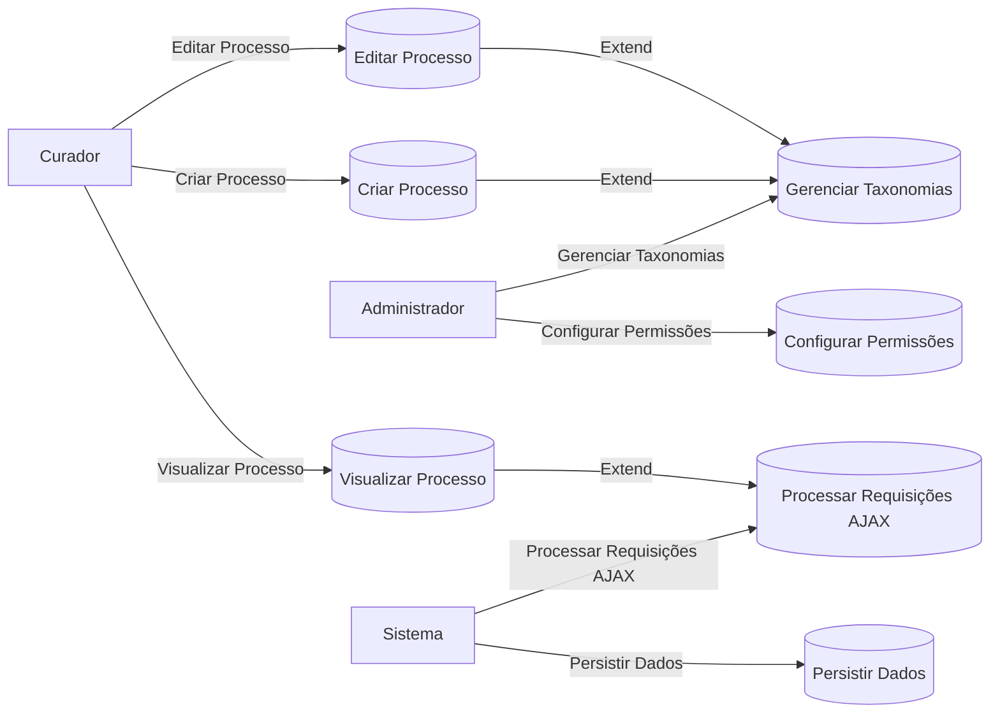
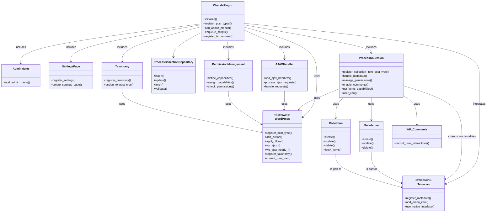

# Documentação do Plugin Obatala

## Visão Geral

O plugin Obatala foi desenvolvido para gerenciar processos curatoriais dentro da plataforma WordPress, utilizando as funcionalidades do plugin Tainacan, um sistema avançado de gestão de coleções digitais. Este documento serve como um estudo de caso detalhado sobre como o plugin foi estruturado, abordando desde a gestão de permissões até a integração com a API do Tainacan.

## Conceitos Envolvidos

### Custom Post Type para Processos Curatoriais

O plugin define um tipo de post personalizado, `processos`, para lidar com os dados curatoriais. Cada processo é uma instância desse tipo de post, o que permite o uso de funcionalidades nativas do WordPress, como a edição, exclusão, e visualização em uma interface padronizada.

### Metadatum e Collection do Tainacan

A integração com o Tainacan é feita através do uso das classes `Metadatum` e `Collection`. Estas classes são utilizadas para manipular os dados dos processos curatoriais, permitindo uma organização detalhada e a possibilidade de expandir as funcionalidades conforme necessário.

### Gerenciamento de Permissões Personalizadas

O plugin implementa um sistema de permissões que define quem pode visualizar, criar, editar ou deletar os processos curatoriais. Isso é realizado através da definição de capacidades específicas dentro do WordPress, garantindo que apenas usuários autorizados tenham acesso a essas funcionalidades.

### Taxonomias para Organização

Taxonomias personalizadas são usadas para categorizar e organizar os processos curatoriais. Essas taxonomias ajudam na filtragem e na busca dentro do sistema, facilitando o gerenciamento de grandes volumes de dados.

### Interface de Usuário e AJAX

O plugin faz uso intenso de AJAX para a interação com a interface de usuário, proporcionando uma experiência fluida e dinâmica sem a necessidade de recarregar a página. Isso é especialmente importante em sistemas de gerenciamento de conteúdo onde a eficiência e a velocidade são cruciais.

## Diagrama de Caso de Uso

Este diagrama ilustra os principais casos de uso envolvendo diferentes atores dentro do sistema. Ele destaca como os curadores interagem com o sistema para criar, editar e visualizar processos, enquanto os administradores configuram permissões e gerenciam taxonomias. O sistema é responsável por processar as requisições AJAX e persistir os dados.

## Defesa do Projeto

A escolha de integrar o plugin Obatala com o Tainacan justifica-se pela robustez do Tainacan na gestão de coleções e metadados, o que é essencial para o gerenciamento de processos curatoriais complexos. O uso de AJAX e a customização de permissões proporcionam uma interface segura, eficiente e amigável para os usuários.

A implementação de taxonomias personalizadas e o uso de tipos de post customizados garantem que o plugin seja flexível e adaptável às necessidades específicas do gerenciamento curatorial, facilitando a expansão e a customização futura.

Este documento fornece uma visão clara e detalhada do funcionamento e da estrutura do plugin Obatala, servindo como um guia para desenvolvedores, administradores e curadores que irão trabalhar com o sistema.

## Explicação do Diagrama de Classes do Plugin Obatala

O diagrama de classes fornece uma visão estruturada de como os componentes do plugin Obatala interagem uns com os outros e com o framework do WordPress e o plugin Tainacan. Vamos detalhar cada componente chave do diagrama para uma melhor compreensão.

### Classes Principais

#### **1. ObatalaPlugin**
- **Descrição**: Esta é a classe principal do plugin que coordena a inicialização e gestão das funcionalidades principais.
- **Responsabilidades**:
  - Registrar o tipo de postagem personalizado `processos`.
  - Inicializar e gerenciar todas as subclasses necessárias.
  - Carregar os textos do domínio para internacionalização.
  - Adicionar hooks e filtros específicos do plugin.

#### **2. ProcessCollection**
- **Extende**: `Tainacan\Entities\Collection`
- **Descrição**: Representa uma coleção de processos curatoriais, possibilitando a gestão e organização de múltiplos processos dentro do Tainacan.
- **Responsabilidades**:
  - Gerenciar metadados específicos dos processos curatoriais.
  - Utilizar a API do Tainacan para integrar funcionalidades de coleção.

#### **3. ProcessCollectionRepository**
- **Extende**: `Tainacan\Repositories\Collections`
- **Descrição**: Gerencia as operações de banco de dados para as coleções de processos, incluindo operações de salvar, atualizar e recuperar.
- **Responsabilidades**:
  - Executar queries específicas para as coleções de processos.
  - Oferecer métodos para manipular dados dos processos no banco de dados.

### Subclasses de Administração

#### **4. AdminMenu**
- **Descrição**: Gerencia a adição de menus administrativos no WordPress.
- **Responsabilidades**:
  - Registrar páginas de configuração e outras interfaces administrativas relacionadas ao plugin.

#### **5. SettingsPage**
- **Descrição**: Provê uma interface para configuração das opções do plugin.
- **Responsabilidades**:
  - Criar e gerenciar campos e seções de configuração.
  - Salvar e recuperar as configurações do plugin.

### Uso de Namespaces e Autoload

O uso de namespaces é essencial para evitar conflitos de nomes com outras partes do WordPress ou outros plugins. O plugin utiliza o namespace `Obatala` para todos os seus componentes. O autoload configurado através do Composer garante que todas as classes sejam carregadas automaticamente conforme necessário, sem a necessidade de `require` ou `include` manual.

### Integração com WordPress e Tainacan

- **WordPress Hooks e Filters**: O plugin emprega ganchos (`hooks`) do WordPress para integrar e estender funcionalidades, como adicionar tipos de posts personalizados e alterar o painel administrativo.
- **Tainacan API**: Aproveita funcionalidades do Tainacan para gerenciar coleções e metadados, assegurando uma integração profunda com este plugin de gestão de coleções digitais. Essa integração é crucial para manter a consistência e eficácia na gestão de processos curatoriais.

### Considerações Finais

Este documento e a descrição correspondente ressaltam a estrutura modular e a extensibilidade do plugin Obatala, evidenciando como ele se integra eficientemente ao ecossistema do WordPress e ao plugin Tainacan. Esta abordagem não apenas facilita o desenvolvimento e a manutenção mas também assegura que o plugin pode ser expandido ou adaptado conforme necessidades futuras.