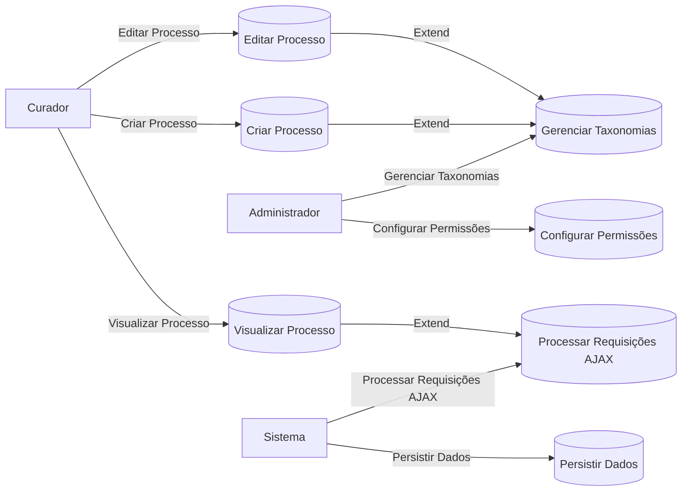
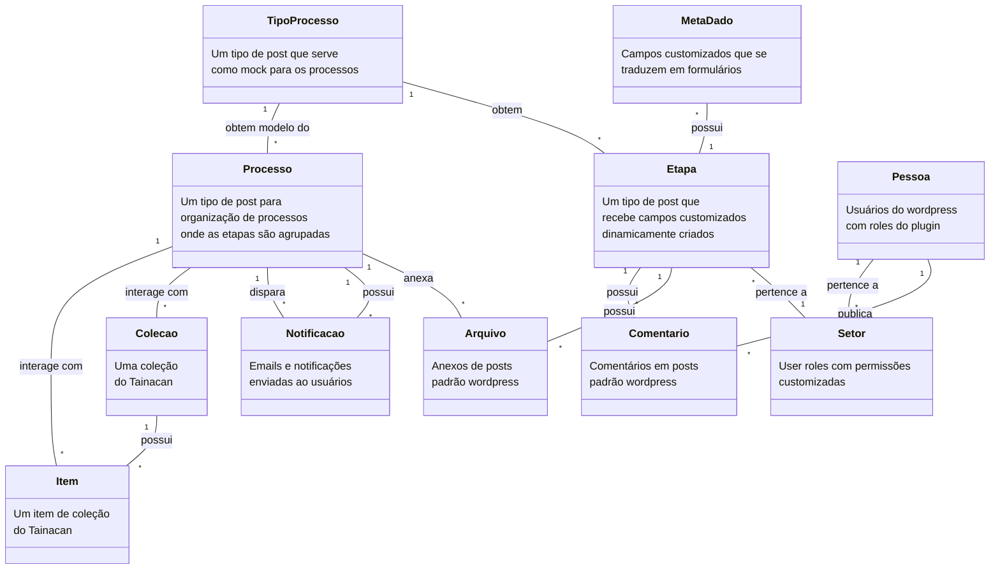

# Documentação do Plugin Obatala

## Visão Geral

O plugin Obatala foi desenvolvido para gerenciar processos curatoriais dentro da plataforma WordPress, utilizando as funcionalidades do plugin Tainacan, um sistema avançado de gestão de coleções digitais. Este documento serve como um estudo de caso detalhado sobre como o plugin foi estruturado, abordando desde a gestão de permissões até a integração com a API do Tainacan.

## Conceitos Envolvidos

### Custom Post Type para Processos Curatoriais

O plugin define um tipo de post personalizado, `processos`, para lidar com os dados curatoriais. Cada processo é uma instância desse tipo de post, o que permite o uso de funcionalidades nativas do WordPress, como a edição, exclusão, e visualização em uma interface padronizada.

### Metadatum e Collection do Tainacan

Não definido

### Gerenciamento de Permissões Personalizadas

O plugin implementa um sistema de permissões que define quem pode visualizar, criar, editar ou deletar os processos curatoriais. Isso é realizado através da definição de capacidades específicas dentro do WordPress, garantindo que apenas usuários autorizados tenham acesso a essas funcionalidades.

### Taxonomias para Organização

Taxonomias personalizadas são usadas para categorizar e organizar os processos curatoriais. Essas taxonomias ajudam na filtragem e na busca dentro do sistema, facilitando o gerenciamento de grandes volumes de dados.

### Interface de Usuário e AJAX

O plugin faz uso intenso de AJAX para a interação com a interface de usuário, proporcionando uma experiência fluida e dinâmica sem a necessidade de recarregar a página. Isso é especialmente importante em sistemas de gerenciamento de conteúdo onde a eficiência e a velocidade são cruciais.

## Diagrama de Caso de Uso

Este diagrama ilustra os principais casos de uso envolvendo diferentes atores dentro do sistema. Ele destaca como os curadores interagem com o sistema para criar, editar e visualizar processos, enquanto os administradores configuram permissões e gerenciam taxonomias. O sistema é responsável por processar as requisições AJAX e persistir os dados.

## Defesa do Projeto

A escolha de integrar o plugin Obatala com o Tainacan justifica-se pela robustez do Tainacan na gestão de coleções e metadados, o que é essencial para o gerenciamento de processos curatoriais complexos. O uso de AJAX e a customização de permissões proporcionam uma interface segura, eficiente e amigável para os usuários.

A implementação de taxonomias personalizadas e o uso de tipos de post customizados garantem que o plugin seja flexível e adaptável às necessidades específicas do gerenciamento curatorial, facilitando a expansão e a customização futura.

Este documento fornece uma visão clara e detalhada do funcionamento e da estrutura do plugin Obatala, servindo como um guia para desenvolvedores, administradores e curadores que irão trabalhar com o sistema.

## Explicação do Diagrama de Classes do Plugin Obatala

O diagrama de classes anexo ilustra uma visão simplificada da organização do plugin e o relacionamento entre as diversas entidades figurantes.

### Explicação do Diagrama de Classes do Plugin Obatala

O diagrama de classes abaixo ilustra a estrutura e as interações entre os principais componentes do plugin Obatala para WordPress. Este plugin é utilizado para a gestão de processos curatoriais, integrando funcionalidades do Tainacan com a flexibilidade dos custom post types do WordPress.

### Descrição das Classes

#### **Processo**
- **Função**: Representa um processo específico que agrupa várias etapas.
- **Uso**: Este tipo de post é a entidade principal onde os processos são organizados e gerenciados. Cada processo pode interagir com itens e coleções do Tainacan, além de disparar e possuir notificações associadas ao seu progresso.

#### **TipoProcesso**
- **Função**: Serve como um modelo ou template para a criação de novos processos.
- **Uso**: Define a estrutura básica de um processo, incluindo uma lista de etapas (`Etapa`). Quando um novo `Processo` é criado, ele herda o modelo do `TipoProcesso`.

#### **Setor**
- **Função**: Representa grupos de usuários com permissões específicas.
- **Uso**: Usado para definir permissões e organizar usuários (`Pessoa`) em grupos que interagem com as etapas (`Etapa`) do processo.

#### **Colecao**
- **Função**: Representa uma coleção do Tainacan.
- **Uso**: Cada `Processo` pode interagir com uma ou mais coleções, facilitando a gestão e a visualização dos itens relacionados.

#### **Item**
- **Função**: Representa um item dentro de uma coleção do Tainacan.
- **Uso**: Os itens são entidades individuais em uma coleção que podem ser associadas a processos, proporcionando um vínculo direto entre os dados curatoriais e os processos.

#### **Etapa**
- **Função**: Representa uma fase ou passo de um processo.
- **Uso**: Cada `Etapa` armazena campos personalizados (`MetaDado`) que são utilizados na interface do processo. As etapas estão associadas a setores (`Setor`), têm anexos (`Arquivo`) e podem ter comentários (`Comentario`).

#### **Notificacao**
- **Função**: Gera e envia notificações e emails aos usuários.
- **Uso**: Notificações são enviadas durante a execução do processo para informar os usuários sobre atualizações importantes, como mudanças de status ou conclusão de etapas.

#### **Pessoa**
- **Função**: Representa os usuários do WordPress com funções definidas pelo plugin.
- **Uso**: Usuários podem pertencer a setores (`Setor`), interagir com processos, adicionar comentários (`Comentario`) e anexar arquivos.

#### **Arquivo**
- **Função**: Anexa documentos ou arquivos ao processo.
- **Uso**: Arquivos são usados para associar documentos relevantes a processos ou etapas específicos. Eles seguem o padrão de anexos do WordPress.

#### **Comentario**
- **Função**: Registra observações e discussões em posts.
- **Uso**: Comentários são usados para discussões e observações em processos ou etapas, seguindo o padrão de comentários do WordPress.

#### **MetaDado**
- **Função**: Define campos personalizados que se traduzem em formulários.
- **Uso**: Os metadados especificam os tipos de campos personalizados exibidos nas etapas (`Etapa`). Eles são usados para capturar informações específicas necessárias para cada fase do processo.

### Relações Entre as Classes

1. **Processo e Itens/Coleções**:
      - Um `Processo` pode interagir com múltiplos `Itens` e `Colecoes` do Tainacan, permitindo a gestão de recursos curatoriais dentro do processo.

2. **Processo e Notificações**:
      - Um `Processo` pode disparar e possuir múltiplas `Notificacoes` ao longo de sua execução, mantendo os usuários informados sobre o progresso.

3. **Etapa e Comentários/Arquivos**:
      - Cada `Etapa` pode possuir vários `Comentarios` e `Arquivos`, permitindo interações ricas e a inclusão de documentos importantes.

4. **TipoProcesso e Processos**:
      - Um `TipoProcesso` serve como modelo para múltiplos `Processos`, definindo sua estrutura e as etapas a serem seguidas.

5. **Pessoa e Setor**:
      - Usuários (`Pessoa`) podem pertencer a um `Setor`, que define suas permissões e seu papel no processo.

6. **TipoProcesso e Etapas**:
      - Um `TipoProcesso` define uma lista de `Etapa` que especifica as fases que os processos baseados nesse tipo seguirão.

7. **Etapa e Setor**:
      - Cada `Etapa` pertence a um `Setor`, que define quem tem permissão para interagir com essa etapa.

8. **MetaDado e Etapa**:
      - `MetaDado` são associados a `Etapa`, definindo os campos personalizados que serão exibidos e preenchidos durante a execução da etapa.

9. **Colecao e Itens**:
      - Uma `Colecao` pode conter múltiplos `Itens`, representando uma coleção de objetos curatoriais gerenciada pelo Tainacan.

### Subclasses de Administração

#### **4. AdminMenu**
- **Descrição**: Gerencia a adição de menus administrativos no WordPress.
- **Responsabilidades**:
  - Registrar páginas de configuração e outras interfaces administrativas relacionadas ao plugin.

#### **5. SettingsPage**
- **Descrição**: Provê uma interface para configuração das opções do plugin.
- **Responsabilidades**:
  - Criar e gerenciar campos e seções de configuração.
  - Salvar e recuperar as configurações do plugin.

### Uso de Namespaces e Autoload

O uso de namespaces é essencial para evitar conflitos de nomes com outras partes do WordPress ou outros plugins. O plugin utiliza o namespace `Obatala` para todos os seus componentes. O autoload configurado através do Composer garante que todas as classes sejam carregadas automaticamente conforme necessário, sem a necessidade de `require` ou `include` manual.

### Integração com WordPress e Tainacan

- **WordPress Hooks e Filters**: O plugin emprega ganchos (`hooks`) do WordPress para integrar e estender funcionalidades, como adicionar tipos de posts personalizados e alterar o painel administrativo.
- **Tainacan API**: Aproveita funcionalidades do Tainacan para gerenciar coleções e metadados, assegurando uma integração profunda com este plugin de gestão de coleções digitais. Essa integração é crucial para manter a consistência e eficácia na gestão de processos curatoriais.

### Considerações Finais

Este documento e a descrição correspondente ressaltam a estrutura modular e a extensibilidade do plugin Obatala, evidenciando como ele se integra eficientemente ao ecossistema do WordPress e ao plugin Tainacan. Esta abordagem não apenas facilita o desenvolvimento e a manutenção mas também assegura que o plugin pode ser expandido ou adaptado conforme necessidades futuras.