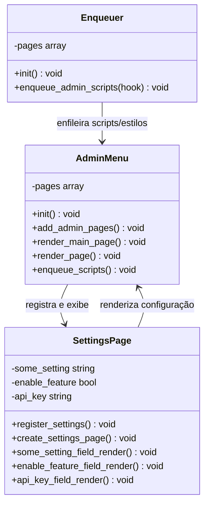

# 📘 Documentação do Plugin Obatala

## 📌 Visão Geral

O plugin **Obatala** foi desenvolvido para gerenciar funcionalidades administrativas e interfaces dentro da plataforma WordPress. Esta documentação descreve as principais classes do sistema — `AdminMenu`, `Enqueuer` e `SettingsPage` — explicando suas funções e interações.

---

## 📚 Conceitos Envolvidos

### 🧭 Gerenciamento de Menus Administrativos

A classe `AdminMenu` é responsável por adicionar menus e submenus personalizados ao painel administrativo do WordPress, oferecendo acesso às configurações e funcionalidades do plugin.

### 🎨 Enfileiramento de Scripts e Estilos

A classe `Enqueuer` é utilizada para carregar os arquivos JavaScript e CSS necessários ao funcionamento do plugin, tanto no painel quanto na interface pública.

### ⚙️ Páginas de Configuração

A classe `SettingsPage` permite que administradores personalizem o funcionamento do plugin, fornecendo uma interface gráfica para definição de opções via painel do WordPress.

---

## 🧩 Diagrama de Classes


```mermaid
classDiagram
    class AdminMenu {
        +init() void
        +add_admin_pages() void
        +render_main_page() void
        +render_page() void
        +enqueue_scripts() void
        -pages array
    }

    class Enqueuer {
        +init() void
        +enqueue_admin_scripts(hook) void
        -pages array
    }

    class SettingsPage {
        +register_settings() void
        +create_settings_page() void
        +some_setting_field_render() void
        +enable_feature_field_render() void
        +api_key_field_render() void
        -some_setting string
        -enable_feature bool
        -api_key string
    }

    AdminMenu --> SettingsPage : registra e exibe
    Enqueuer --> AdminMenu : enfileira scripts/estilos
    SettingsPage --> AdminMenu : renderiza configuração
```

## 🧠 Explicação do Diagrama
- AdminMenu: Cria menus e páginas administrativas.

- Enqueuer: Carrega scripts e estilos personalizados.

- SettingsPage: Permite ao usuário configurar o plugin.

---

## 📦 Classes e Responsabilidades
### 🏛️ AdminMenu
Classe que registra menus e páginas do plugin.

#### 📌 Função
Define o menu principal “Obatala” e seus submenus com acesso a diferentes funcionalidades do plugin.

#### 🔧 Responsabilidades
- init(): Inicializa o registro de menus e scripts.

- add_admin_pages(): Adiciona páginas ao menu do WordPress.

- render_main_page(): Exibe a tela principal.

- render_page(): Carrega páginas secundárias com base no submenu.

- enqueue_scripts(): Insere estilos e scripts necessários no painel.

#### 🧩 Exemplo de Estrutura de Menu
```php
private static $pages = [
    'main' => [
        'title' => 'obatala',
        'menu_title' => 'obatala',
        'capability' => 'manage_options',
        'slug' => 'obatala-main',
        'callback' => 'render_main_page',
        'icon' => 'dashicons-admin-site',
        'position' => 2
    ],
    'submenus' => [
        [
            'parent_slug' => 'obatala-main',
            'title' => 'Dashboard',
            'menu_title' => 'Dashboard',
            'capability' => 'manage_options',
            'slug' => 'obatala-main',
            'callback' => 'render_main_page',
            'show_in_menu' => true
        ],
        [
            'parent_slug' => 'obatala-main',
            'title' => 'Processes',
            'menu_title' => 'Processes',
            'capability' => 'manage_options',
            'slug' => 'process-manager',
            'callback' => 'render_page',
            'show_in_menu' => true
        ],
        [
            'parent_slug' => 'obatala-main',
            'title' => 'Models',
            'menu_title' => 'Models',
            'capability' => 'edit_posts',
            'slug' => 'process-type-manager',
            'callback' => 'render_page',
            'show_in_menu' => true
        ],
        [
            'parent_slug' => 'obatala-main',
            'title' => 'Groups',
            'menu_title' => 'Groups',
            'capability' => 'manage_options',
            'slug' => 'sector_manager',
            'callback' => 'render_page',
            'show_in_menu' => true
        ],
        // ... Process type editor, Process viewer, Group details, Mappers
    ]
];
```

Os títulos são traduzidos em tempo de execução via `__($submenu['title'], 'obatala')` em `add_admin_pages()`, pois funções não podem ser usadas em propriedades estáticas (expressões constantes).

### 🧱 Enqueuer
Classe que gerencia o carregamento de arquivos de estilo e script.

#### 📌 Função
Evita carregamento desnecessário de recursos, otimizando desempenho e compatibilidade com o painel do WordPress.

#### 🔧 Responsabilidades
- init(): Registra o hook admin_enqueue_scripts.

- enqueue_admin_scripts($hook): Valida se a página atual exige scripts do plugin e os enfileira.

#### 🧩 Recursos Carregados
- build/index.js: Código JavaScript principal.

- css/style.css: Estilização personalizada.

- css/react-flow.css: Estilos do editor de fluxo.

#### 🧩 Lista de Páginas com Scripts

```php
private static $pages = [
    'obatala_page_process-manager' => 'process-manager',
    'obatala_page_process-type-manager' => 'process-type-manager',
    'obatala_page_process-viewer' => 'process-viewer',
    'obatala_page_process-step-manager' => 'process-step-manager',
    'obatala_page_process-type-editor' => 'process-type-editor',
    'obatala_page_sector_manager' => 'sector_manager',
    'toplevel_page_obatala-main' => 'dashboard',
    'obatala_page_sector-details' => 'sector-details',
    'obatala_page_mappers' => 'mappers',
];
```

O `Enqueuer` também chama `wp_set_script_translations()` para carregar as traduções do frontend React em JSON.

### ⚙️ SettingsPage
Classe que cria e renderiza campos configuráveis no painel de administração.

#### 📌 Função
Permite ao administrador configurar opções como ativar/desativar funcionalidades ou informar chaves de API.

#### 🔧 Responsabilidades
- register_settings(): Registra os campos na API de opções do WP.

- create_settings_page(): Gera a página e o formulário HTML.

- some_setting_field_render(): Campo de texto.

- enable_feature_field_render(): Checkbox de ativação.

- api_key_field_render(): Campo de chave de API.

#### 🧩 Exemplo de Registro de Campos
```php
register_setting('obatala_settings_group', 'some_setting');
register_setting('obatala_settings_group', 'enable_feature');
register_setting('obatala_settings_group', 'api_key');
```

---

### 🌐 Internacionalização
O plugin suporta tradução em PHP (via `.po`/`.mo`) e em React (via JSON). O domínio de texto é `obatala`. Consulte [Internacionalização](internacionalizacao.md) para o fluxo de trabalho completo.

### ✅ Considerações Finais
- As classes são organizadas conforme o padrão PSR-4.

- A separação de responsabilidades garante melhor manutenção do código.

- O uso de namespaces evita conflitos e promove clareza.

- A documentação facilita o onboarding de novos desenvolvedores e a manutenção contínua do projeto.

