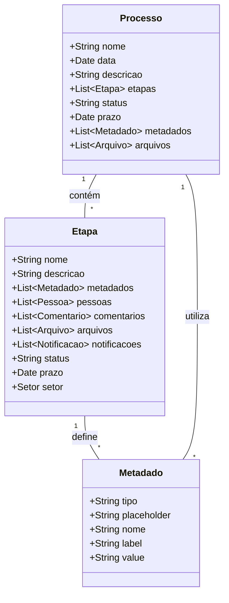

# Metadados Dinâmicos para Gestão de Processos no Plugin Obatala

<!-- experimental shield -->


!!! Atenção
    Os snippets de código neste documento são apenas modelos ilustrativos.

O plugin Obatala permite a criação e gerenciamento de processos curatoriais no WordPress. Uma das funcionalidades avançadas do plugin é a capacidade de criar metadados dinâmicos que se adaptam às necessidades específicas de cada etapa do processo. Esta documentação explica como implementar e utilizar metadados dinâmicos dentro das interfaces de processo e etapa.

### Conceito de Metadados Dinâmicos

Os metadados dinâmicos são dados adicionais associados a cada etapa de um processo, armazenados como `post_meta` no WordPress. Esses metadados são representações de campos de formulário, que podem ser configurados e personalizados dinamicamente pelos usuários.

#### Exemplo de Metadado Dinâmico

Um metadado dinâmico para um campo de texto pode ser representado da seguinte forma:

```json
text_input_918309123 = {
    "tipo":  "text",
    "placeholder": "Digite uma informação...",
    "nome": "input-de-texto",
    "label": "Informação",
    "value": "valor inicial",
}
```

Neste exemplo:
- `text_input_918309123` é a chave do `post_meta`, onde `text_input` identifica o tipo de campo e `918309123` é um identificador único.
- O valor associado é um objeto JSON que define as propriedades do campo de entrada de texto:
  - `tipo`: Tipo do campo (neste caso, um campo de texto).
  - `placeholder`: Texto de sugestão exibido dentro do campo.
  - `nome`: Nome do campo, utilizado como referência no formulário.
  - `label`: Rótulo descritivo para o campo.
  - `value`: Valor inicial preenchido no campo.

### Implementação de Metadados Dinâmicos

#### 1. Criando Metadados Dinâmicos nas Etapas

Nas etapas (`ProcessStep`), os metadados são utilizados como modelos para os campos que serão exibidos no processo. 

##### Interface para Adicionar Metadados Dinâmicos

A interface de administração do WordPress permite aos usuários adicionar e configurar metadados dinâmicos para cada etapa. Isso é feito através de uma interface em React que oferece opções para escolher o tipo de campo e suas propriedades.

##### Exemplo de Interface de Configuração

```javascript
import React, { useState } from 'react';

function DynamicFieldConfigurator() {
    const [fields, setFields] = useState([]);

    const addField = (type) => {
        const newField = {
            id: Date.now(),
            tipo: type,
            placeholder: "",
            nome: "",
            label: "",
            value: "",
        };
        setFields([...fields, newField]);
    };

    return (
        <div>
            <button onClick={() => addField('text')}>Adicionar Campo de Texto</button>
            <button onClick={() => addField('number')}>Adicionar Campo Numérico</button>
            {/* Adicione mais botões para outros tipos de campos conforme necessário */}
            <div>
                {fields.map(field => (
                    <div key={field.id}>
                        <label>{field.label}</label>
                        <input 
                            type={field.tipo} 
                            placeholder={field.placeholder} 
                            name={field.nome} 
                            value={field.value} 
                            onChange={(e) => {
                                field.value = e.target.value;
                                setFields([...fields]);
                            }}
                        />
                    </div>
                ))}
            </div>
        </div>
    );
}
```

Este exemplo simples de interface permite adicionar campos de texto e numéricos e configurar suas propriedades.

#### 2. Armazenando Metadados como `post_meta`

Após configurar os metadados, eles são salvos como `post_meta` no WordPress. Cada campo de metadados é armazenado com uma chave única que combina o tipo de campo e um identificador.

##### Exemplo de Armazenamento em `post_meta`

```php
function save_dynamic_fields($post_id, $fields) {
    foreach ($fields as $field) {
        $meta_key = "{$field['tipo']}_{$field['id']}";
        update_post_meta($post_id, $meta_key, json_encode($field));
    }
}
```

Nesta função, cada campo é salvo no banco de dados do WordPress com uma chave única baseada no tipo e identificador do campo.

#### 3. Exibindo Metadados Dinâmicos na Interface de Gestão de Processos

Na interface de gestão de processos (`Process`), os campos definidos como metadados dinâmicos nas etapas são renderizados de acordo com suas configurações. 

##### Renderizando Campos Dinâmicos

```javascript
import React from 'react';

function DynamicFieldRenderer({ fields }) {
    return (
        <div>
            {fields.map(field => (
                <div key={field.id}>
                    <label>{field.label}</label>
                    <input 
                        type={field.tipo} 
                        placeholder={field.placeholder} 
                        name={field.nome} 
                        value={field.value} 
                        onChange={(e) => {
                            field.value = e.target.value;
                            // Atualizar o estado ou enviar a mudança de valor para o backend conforme necessário
                        }}
                    />
                </div>
            ))}
        </div>
    );
}
```

Este componente renderiza os campos de formulário baseados nos metadados dinâmicos.

### Fluxo de Trabalho para Metadados Dinâmicos

1. **Configuração de Metadados nas Etapas**: O usuário define e configura campos personalizados através da interface de configuração de metadados na etapa.
2. **Armazenamento de Metadados**: Os campos configurados são salvos como `post_meta` no banco de dados do WordPress.
3. **Renderização de Campos no Processo**: Durante a execução de um processo, os campos dinâmicos são renderizados na interface do processo, permitindo que os usuários preencham e interajam com eles.
4. **Salvamento de Dados do Processo**: Os valores preenchidos pelos usuários nos campos dinâmicos são armazenados como `post_meta` do processo.

### Diagrama do Processo de Metadados Dinâmicos



### Conclusão

Os metadados dinâmicos no plugin Obatala proporcionam uma flexibilidade significativa na configuração e gestão de processos curatoriais. Ao permitir a criação e personalização de campos de formulário dinâmicos, o plugin atende às necessidades específicas de cada processo e etapa, facilitando a interação dos usuários com o sistema e melhorando a eficiência na gestão de dados curatoriais.