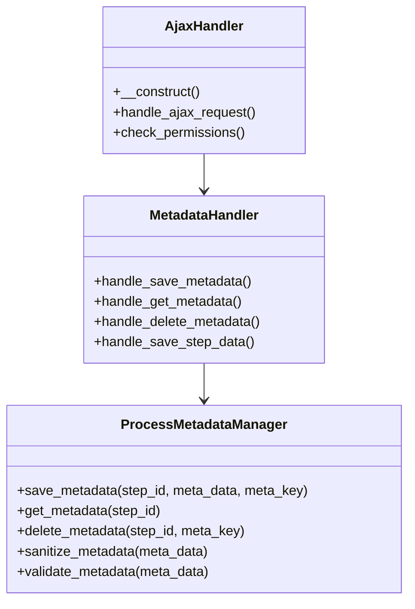
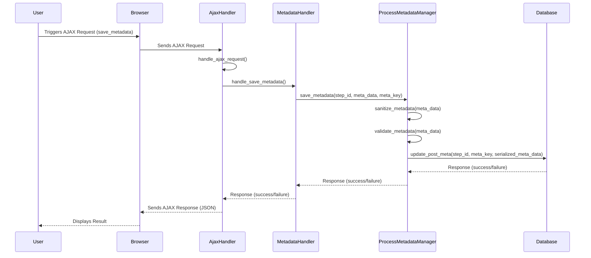

#Implementação de Metadados Dinâmicos

## Arquivos e Classes

### `ProcessMetadataManager.php`

Esta classe é responsável por gerenciar os metadados dinâmicos associados às etapas de um processo. Suas principais responsabilidades incluem salvar, recuperar e deletar metadados no banco de dados do WordPress.

#### Métodos Principais

- **save_metadata($step_id, $meta_data, $meta_key = " ")**: Adiciona ou atualiza um metadado dinâmico para uma etapa específica. Sanitiza e valida os dados antes de salvá-los como JSON.
  
- **get_metadata($step_id)**: Recupera todos os metadados dinâmicos associados a uma etapa específica.

- **delete_metadata($step_id, $meta_key)**: Remove um metadado dinâmico específico de uma etapa.

- **sanitize_metadata($meta_data)**: Sanitiza os dados dos metadados.

- **validate_metadata($meta_data)**: Valida os dados dos metadados.

### `MetadataHandler.php`

Esta classe é responsável por lidar com as requisições relacionadas aos metadados. Atua como intermediária entre as requisições AJAX e a `ProcessMetadataManager`.

#### Métodos Principais

- **handle_save_metadata()**: Lida com a requisição para salvar metadados.

- **handle_get_metadata()**: Lida com a requisição para recuperar metadados.

- **handle_delete_metadata()**: Lida com a requisição para deletar metadados.

- **handle_save_step_data()**: Lida com a requisição para salvar dados de uma etapa.

### `AjaxHandler.php`

Esta classe registra os endpoints AJAX no WordPress e direciona as requisições para os métodos apropriados no `MetadataHandler`.

#### Métodos Principais

- **__construct()**: Registra os hooks AJAX do WordPress.

- **handle_ajax_request()**: Lida com as requisições AJAX, verifica a segurança (nonce) e direciona a ação para o método correspondente no `MetadataHandler`.

- **check_permissions()**: Verifica as permissões do usuário para garantir que apenas usuários autorizados possam realizar ações específicas.

## Fluxo de Trabalho



1. **Requisição AJAX**: Quando uma ação relacionada aos metadados é disparada no front-end, uma requisição AJAX é enviada para um endpoint registrado pelo `AjaxHandler`.

2. **Manipulação da Requisição**: O `AjaxHandler` verifica a validade da requisição (por exemplo, verificando um nonce de segurança) e direciona a ação para o método correspondente no `MetadataHandler`.

3. **Processamento dos Metadados**: O `MetadataHandler` utiliza os métodos do `ProcessMetadataManager` para realizar a operação solicitada (salvar, recuperar, deletar).

4. **Resposta AJAX**: O resultado da operação é retornado ao front-end como uma resposta JSON.

## Exemplo de Uso

### Adicionar ou Atualizar Metadados

```php
<?
    $meta_data = array(
        "type" => "text",
        "placeholder" => "Digite uma informação...",
        "name" => "input-de-texto",
        "label" => "Informação",
        "value" => "valor inicial"
    );

    $step_id = 123; // ID da etapa
    $meta_key = ''; // Deixe vazio para gerar uma nova chave única ou forneça uma existente para atualizar
    ProcessMetadataManager::save_metadata($step_id, $meta_data, $meta_key);
```

### Recuperar Metadados

```php
<?
    $step_id = 123; // ID da etapa
    $metadata = ProcessMetadataManager::get_metadata($step_id);
    // $metadata agora contém todos os metadados dinâmicos associados a esta etapa
```

### Remover Metadados

```php
<?
    $step_id = 123; // ID da etapa
    $meta_key = 'dynamic_field_123456'; // A chave do metadado a ser removido
    ProcessMetadataManager::delete_metadata($step_id, $meta_key);
```

## Considerações Finais

Essa implementação oferece uma solução robusta para gerenciar metadados dinâmicos em processos e etapas no WordPress. Seguindo as melhores práticas de desenvolvimento, o sistema é seguro, eficiente e fácil de integrar com outras funcionalidades do WordPress.