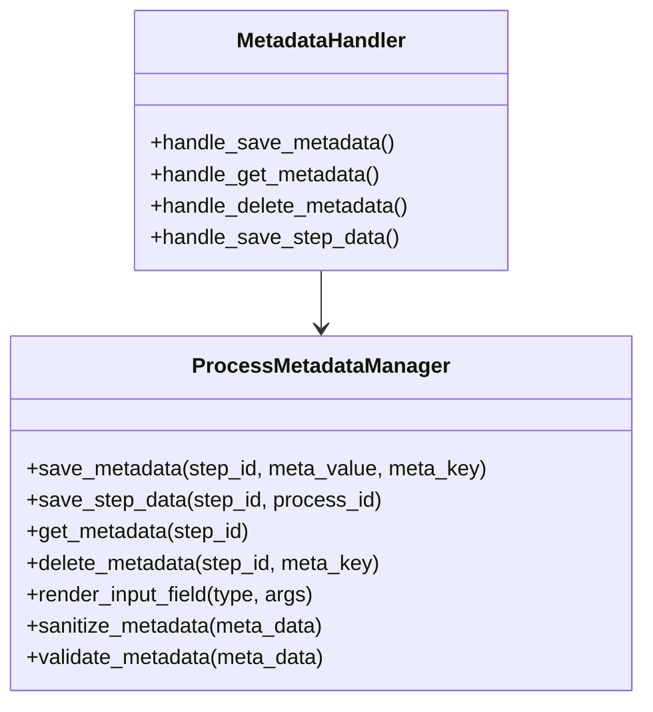

# Implementação de Metadados Dinâmicos

## Arquivos e Classes

## ProcessMetadataManager.php

Esta classe é responsável por gerenciar os metadados dinâmicos associados às etapas de um processo. Suas principais responsabilidades incluem salvar, recuperar e deletar metadados no banco de dados do WordPress.

## Métodos Principais

- **save_metadata($step_id, $meta_value, $meta_key)**: Adiciona ou atualiza um metadado dinâmico para uma etapa específica. Se a chave do metadado não for fornecida, um identificador único é gerado. O valor do metadado é sanitizado e validado antes de ser salvo.

- **save_step_data($step_id, $process_id)**: Salva os dados dos campos de uma etapa do processo, armazenando todos os metadados associados a esta etapa no post_meta do processo.

- **get_metadata($step_id)**: Recupera todos os metadados dinâmicos associados a uma etapa específica. Retorna um array de metadados filtrados pelo prefixo definido.

- **delete_metadata($step_id, $meta_key)**: Remove um metadado dinâmico específico de uma etapa, retornando um valor booleano indicando o sucesso ou falha da operação.

- **render_input_field($type, $args)**: Renderiza um campo de input com base no tipo especificado. O tipo de campo é adicionado aos argumentos, e os dados do campo são salvos como metadado para uso posterior.

- **sanitize_metadata($meta_data)**: Sanitiza os dados do metadado, garantindo que os campos como 'type', 'name', 'value', 'label', e 'options' sejam tratados corretamente antes do armazenamento.

- **validate_metadata($meta_data)**: Valida os dados do metadado, verificando se o campo "name" foi fornecido.

## Exemplos de Uso

### Salvar Metadados
```php
<?php
    ProcessMetadataManager::save_metadata($step_id, $meta_value, $meta_key);
    Recuperar Metadados:
?>
```

### Recuperar Metadados
```php
<?php
    $metadata = ProcessMetadataManager::get_metadata($step_id);
?>
```

### Deletar Metadados
```php
<?php
    ProcessMetadataManager::delete_metadata($step_id, $meta_key);
?>
```

### Salvar Dados da Etapa:
```php
<?php
    ProcessMetadataManager::save_step_data($step_id, $process_id);
?>
```

### Renderizar um Campo de Input
```php
<?php
    ProcessMetadataManager::render_input_field('text', ['step_id' => $step_id, 'name' => 'campo_exemplo', 'label' => 'Campo de Exemplo']);
?>
```

## Conclusão
É importante garantir que os IDs das etapas sejam válidos e que os dados a serem salvos sejam sanitizados e validados para evitar problemas de segurança e integridade de dados.
A classe utiliza funções nativas do WordPress para manipulação de metadados, garantindo uma integração adequada com a base de dados.
