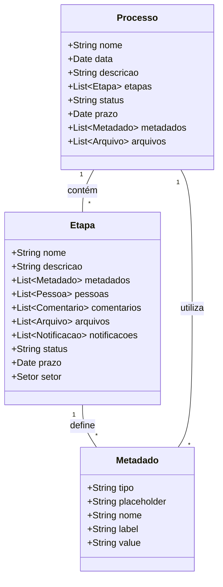

# Metadados Dinâmicos para Gestão de Processos no Plugin Obatala


## Atenção
Os snippets de código neste documento são apenas modelos ilustrativos.

O plugin Obatala permite a criação e o gerenciamento de processos curatoriais no WordPress, utilizando metadados dinâmicos para atender às necessidades específicas de cada etapa. Esta documentação detalha como implementar e utilizar esses metadados dentro das interfaces de processos e etapas.

---

## Conceito de Metadados Dinâmicos

Os metadados dinâmicos no Obatala são dados adicionais associados a cada etapa de um processo, armazenados como `post_meta` no WordPress. Esses metadados representam campos de formulário que podem ser configurados dinamicamente.

### Exemplo de Metadado Dinâmico: Estrutura do `flowData`

O `flowData` é uma estrutura que organiza as etapas de um processo e seus campos personalizados. Veja um exemplo de como o `flowData` é estruturado:

```php
<?php
    flowData = [
        [
            'nodes' => [
                [
                    'id' => 'Etapa 1',
                    'type' => 'customNode',
                    'dragHandle' => '.custom-drag-handle',
                    'position' => ['x' => 50, 'y' => 50],
                    'data' => [
                        'fields' => [
                            [
                                'id' => 'text-1',
                                'type' => 'text',
                                'title' => 'Campo sem título',
                                'config' => [
                                    'label' => 'Campo sem título',
                                    'placeholder' => 'adds shine',
                                    'required' => false,
                                    'minLength' => '10',
                                    'maxLength' => 100,
                                    'pattern' => '',
                                    'helpText' => 'adds shine adds shine adds shine adds shine',
                                ],
                            ],
                        ],
                        'stageName' => 'Etapa 1',
                    ],
                    'measured' => ['width' => 200, 'height' => 133],
                    'selected' => true,
                ],
            ],
            'edges' => [],
        ],
    ];
?>
```

## Componentes do flowData

- **nodes**: Contém as etapas do processo, onde cada etapa inclui informações específicas:
  - **id**: Identificador único da etapa, como Etapa 1.
  - **type**: Tipo do nó, definido como `customNode`.
  - **dragHandle**: Classe CSS usada para arrastar o nó.
  - **position**: Coordenadas de posição (x, y) da etapa na interface.
  - **data**: Dados da etapa, incluindo:
    - **fields**: Campos personalizados da etapa, cada um com:
      - **id**: Identificador único do campo, ex.: text-1.
      - **type**: Tipo do campo, como text.
      - **title**: Título do campo.
      - **config**: Configurações do campo, com propriedades como `label`, `placeholder`, `required`, `minLength`, `maxLength`, `pattern`, e `helpText`.
    - **stageName**: Nome da etapa, como Etapa 1.
  - **measured**: Dimensões da etapa (largura e altura) para a renderização.
  - **selected**: Indica se a etapa está selecionada (booleano).
- **edges**: Define conexões entre etapas, permitindo representar visualmente o fluxo entre elas. Neste exemplo, está vazio.

## Implementação de Metadados Dinâmicos

### Criando Metadados Dinâmicos nas Etapas

Nas etapas (ProcessModel), os metadados configurados são utilizados como modelos para os campos exibidos no processo.

### Interface para Adicionar Metadados Dinâmicos

A interface de administração do WordPress permite aos usuários adicionar e configurar metadados dinâmicos para cada etapa, usando uma interface em React.

```javascript
import React, { useState } from 'react';

function DynamicFieldConfigurator() {
    const [fields, setFields] = useState([]);

    const addField = (type) => {
        const newField = {
            id: Date.now(),
            type: type,
            placeholder: "",
            name: "",
            label: "",
            value: "",
        };
        setFields([...fields, newField]);
    };

    return (
        <div>
            <button onClick={() => addField('text')}>Adicionar Campo de Texto</button>
            <button onClick={() => addField('number')}>Adicionar Campo Numérico</button>
            <div>
                {fields.map(field => (
                    <div key={field.id}>
                        <label>{field.label}</label>
                        <input 
                            type={field.type} 
                            placeholder={field.placeholder} 
                            name={field.name} 
                            value={field.value} 
                            onChange={(e) => {
                                field.value = e.target.value;
                                setFields([...fields]);
                            }}
                        />
                    </div>
                ))}
            </div>
        </div>
    );
}
```

## Armazenando Metadados como post_meta

Após configurar os metadados, eles são salvos no WordPress como `post_meta`. Cada campo é armazenado com uma chave única que combina o tipo e o identificador do campo.

```php
<?php
    function save_dynamic_fields($post_id, $fields) {
        foreach ($fields as $field) {
            $meta_key = "{$field['type']}_{$field['id']}";
            update_post_meta($post_id, $meta_key, json_encode($field));
        }
    }
?>
```

## Exibindo Metadados Dinâmicos na Interface de Gestão de Processos

Na interface de gestão de processos, os campos dinâmicos definidos nos metadados são renderizados conforme as configurações.

```javascript
import React from 'react';

function DynamicFieldRenderer({ fields }) {
    return (
        <div>
            {fields.map(field => (
                <div key={field.id}>
                    <label>{field.label}</label>
                    <input 
                        type={field.type} 
                        placeholder={field.placeholder} 
                        name={field.name} 
                        value={field.value} 
                        onChange={(e) => {
                            field.value = e.target.value;
                        }}
                    />
                </div>
            ))}
        </div>
    );
}
```

## Fluxo de Trabalho para Metadados Dinâmicos

1. **Configuração de Metadados nas Etapas**: O usuário define campos personalizados através da interface de configuração na etapa.
2. **Armazenamento de Metadados**: Os campos configurados são salvos como `post_meta`.
3. **Renderização de Campos no Processo**: Durante a execução do processo, os campos dinâmicos são renderizados na interface.
4. **Salvamento de Dados do Processo**: Os valores preenchidos são armazenados como `post_meta`.

## Diagrama do Processo de Metadados Dinâmicos



## Conclusão
Os metadados dinâmicos no plugin Obatala oferecem flexibilidade para a configuração de processos curatoriais, permitindo a criação e personalização de campos conforme a necessidade de cada etapa. A estrutura flowData organiza visualmente o processo e simplifica a interação do usuário com o sistema, melhorando a gestão de dados curatoriais.
