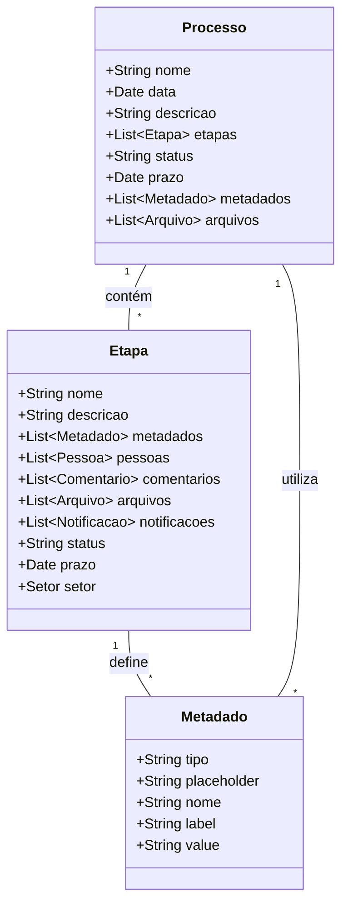

# Metadados Dinâmicos para Gestão de Processos no Plugin Obatala


## Atenção
Os snippets de código neste documento são apenas modelos ilustrativos.

O plugin Obatala permite a criação e o gerenciamento de processos curatoriais no WordPress, utilizando metadados dinâmicos para atender às necessidades específicas de cada etapa. Esta documentação detalha como implementar e utilizar esses metadados dentro das interfaces de processos e etapas.

Para o campo especial **Documento da etapa** (`stage_document`), com editor rico, PDF e anexo assinado, consulte [Documento da etapa](documento-etapa.md). A geração de PDF exige [Composer instalado](../instalacao.md#2-instalar-dependências-php-composer).

---

## Conceito de Metadados Dinâmicos

Os metadados dinâmicos no Obatala são dados adicionais associados a cada etapa de um processo, armazenados como `post_meta` no WordPress. Esses metadados representam campos de formulário que podem ser configurados dinamicamente.

### Exemplo de Metadado Dinâmico: Estrutura do `flowData`

O `flowData` é uma estrutura que organiza as etapas de um processo e seus campos personalizados. Veja um exemplo de como o `flowData` é estruturado:

```php
<?php
    flowData = [
        "nodes": [
            {
            "id": "Etapa 1",
            "type": "customNode",
            "node_status": "Finished",
            "dragHandle": ".custom-drag-handle",
            "position": { "x": 50, "y": 50 },
            "data": {
                "stageName": "Etapa 1",
                "fields": [
                {
                    "id": "text-1",
                    "type": "text",
                    "title": "Campo sem título",
                    "config": {
                    "label": "Texto",
                    "placeholder": "texto",
                    "required": true,
                    "minLength": 0,
                    "maxLength": 100,
                    "pattern": "",
                    "helpText": ""
                    }
                }
                ],
                "condition": []
            },
            "sector_obatala": "681b5e85378a94.20171523",
            "sector_history": ["..."],
            "tempSector": "...",
            "measured": { "width": 259, "height": 341 },
            "selected": false
            }
        ],
        "edges": [
            {
            "id": "xy-edge__Start-Etapa 1",
            "source": "Start",
            "target": "Etapa 1",
            "type": "buttonedge"
            }
        ]
    ];
?>
```

### 🔹 nodes: Etapas do processo
Cada etapa do processo contém os seguintes componentes:

- id: Identificador único da etapa (ex: "Etapa 1").

- type: Tipo do nó, como "customNode", "startNode" ou "endNode".

- node_status: Estado atual do nó (ex: "Stopped", "Finished").

- dragHandle: Classe CSS utilizada para permitir o arrasto do nó na interface.

- position: Objeto com as coordenadas x e y para a posição do nó na tela.

- data:

    - stageName: Nome da etapa (ex: "Etapa 1").

    - fields: Lista de campos personalizados da etapa, cada um com:

        - id: Identificador do campo (ex: "text-1").

        - type: Tipo do campo (ex: "text", "email", "number", "phone", "address").

        - title: Título do campo (visível na interface).

        - config: Configurações específicas do campo:

            - label, placeholder, required, minLength, maxLength, pattern, helpText, min, max, step (dependendo do tipo).

    - condition: (opcional) Lógica de decisão condicional entre etapas (array vazio por padrão).

- measured: Dimensões do nó para renderização, com width e height.

- selected: Define se o nó está atualmente selecionado (true ou false).

- sector_obatala: ID do setor atual vinculado à etapa.

- sector_history: Lista com o histórico de setores pelos quais o nó passou.

- tempSector: Setor temporário associado à etapa.

### 🔹 edges: Conexões entre etapas
As conexões definem o caminho entre os nós e a sequência do fluxo.

Cada item contém:

- id: Identificador único da ligação (ex: "xy-edge__Etapa 1-Etapa 2").

- source: ID da etapa de origem.

- target: ID da etapa de destino.

- type: Tipo da conexão (ex: "buttonedge").

### 🔹 Campos adicionais no meta
Além do nodes e edges, a estrutura atual também inclui os seguintes campos complementares:

- status: Estado geral do processo (ex: ["Finished"]).

- stageData: Dados submetidos nas etapas, com os campos preenchidos, data/hora (updateAt) e usuário responsável (user).

- submittedStages: Mapeamento de quais etapas foram submetidas.

- current_stage: Etapa atual do processo (ex: "Etapa 5").

- groupResponsible: Grupo responsável pela execução (ex: "grupo1").

## Implementação de Metadados Dinâmicos

### Criando Metadados Dinâmicos nas Etapas

Nas etapas (ProcessModel), os metadados configurados são utilizados como modelos para os campos exibidos no processo.

### Interface para Adicionar Metadados Dinâmicos

A interface de administração do WordPress permite aos usuários adicionar e configurar metadados dinâmicos para cada etapa, usando uma interface em React.

```javascript
import React, { useState } from 'react';

function DynamicFieldConfigurator() {
    const [fields, setFields] = useState([]);

    const addField = (type) => {
        const newField = {
            id: Date.now(),
            type: type,
            placeholder: "",
            name: "",
            label: "",
            value: "",
        };
        setFields([...fields, newField]);
    };

    return (
        <div>
            <button onClick={() => addField('text')}>Adicionar Campo de Texto</button>
            <button onClick={() => addField('number')}>Adicionar Campo Numérico</button>
            <div>
                {fields.map(field => (
                    <div key={field.id}>
                        <label>{field.label}</label>
                        <input 
                            type={field.type} 
                            placeholder={field.placeholder} 
                            name={field.name} 
                            value={field.value} 
                            onChange={(e) => {
                                field.value = e.target.value;
                                setFields([...fields]);
                            }}
                        />
                    </div>
                ))}
            </div>
        </div>
    );
}
```

## Armazenando Metadados como post_meta

Após configurar os metadados, eles são salvos no WordPress como `post_meta`. Cada campo é armazenado com uma chave única que combina o tipo e o identificador do campo.

```php
<?php
    function save_dynamic_fields($post_id, $fields) {
        foreach ($fields as $field) {
            $meta_key = "{$field['type']}_{$field['id']}";
            update_post_meta($post_id, $meta_key, json_encode($field));
        }
    }
?>
```

## Exibindo Metadados Dinâmicos na Interface de Gestão de Processos

Na interface de gestão de processos, os campos dinâmicos definidos nos metadados são renderizados conforme as configurações.

```javascript
import React from 'react';

function DynamicFieldRenderer({ fields }) {
    return (
        <div>
            {fields.map(field => (
                <div key={field.id}>
                    <label>{field.label}</label>
                    <input 
                        type={field.type} 
                        placeholder={field.placeholder} 
                        name={field.name} 
                        value={field.value} 
                        onChange={(e) => {
                            field.value = e.target.value;
                        }}
                    />
                </div>
            ))}
        </div>
    );
}
```

## Fluxo de Trabalho para Metadados Dinâmicos

1. **Configuração de Metadados nas Etapas**: O usuário define campos personalizados através da interface de configuração na etapa.
2. **Armazenamento de Metadados**: Os campos configurados são salvos como `post_meta`.
3. **Renderização de Campos no Processo**: Durante a execução do processo, os campos dinâmicos são renderizados na interface.
4. **Salvamento de Dados do Processo**: Os valores preenchidos são armazenados como `post_meta`.

## Diagrama do Processo de Metadados Dinâmicos


```mermaid
classDiagram
    class Processo {
        +String nome
        +Date data
        +String descricao
        +List~Etapa~ etapas
        +String status
        +Date prazo
        +List~Metadado~ metadados
        +List~Arquivo~ arquivos
    }

    class Etapa {
        +String nome
        +String descricao
        +List~Metadado~ metadados
        +List~Pessoa~ pessoas
        +List~Comentario~ comentarios
        +List~Arquivo~ arquivos
        +List~Notificacao~ notificacoes
        +String status
        +Date prazo
        +Setor setor
    }

    class Metadado {
        +String tipo
        +String placeholder
        +String nome
        +String label
        +String value
    }

    Processo "1" -- "*" Etapa : contém
    Etapa "1" -- "*" Metadado : define
    Processo "1" -- "*" Metadado : utiliza
```

## Conclusão
Os metadados dinâmicos no plugin Obatala oferecem flexibilidade para a configuração de processos curatoriais, permitindo a criação e personalização de campos conforme a necessidade de cada etapa. A estrutura flowData organiza visualmente o processo e simplifica a interação do usuário com o sistema, melhorando a gestão de dados curatoriais.
