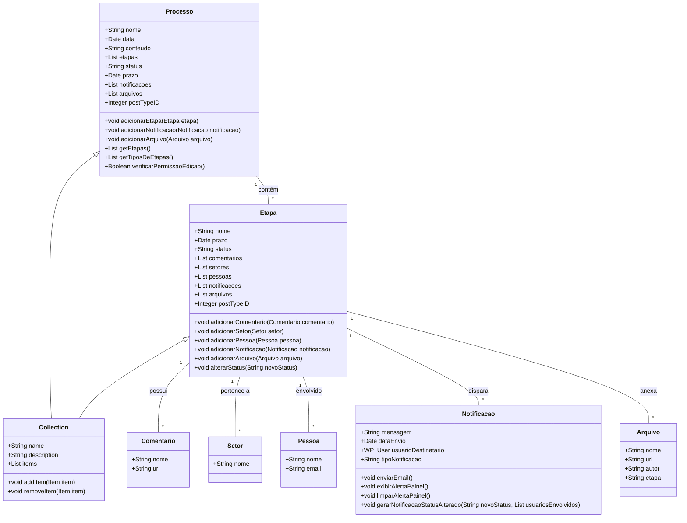
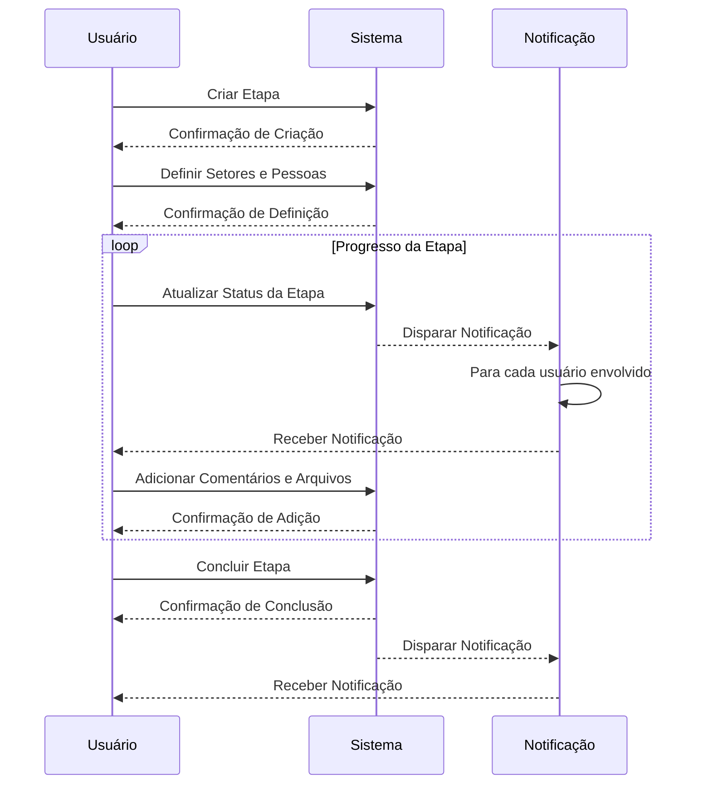

### Documento de Modelagem de Classe: Etapa

---

## Introdução

Este documento descreve a modelagem da classe `Etapa` dentro do sistema "Obatala", que será utilizado para gerenciar etapas de processos curatoriais no WordPress. A classe `Etapa` será um tipo de post customizado, permitindo a criação de campos customizados e a integração com o gerador de metadados do Tainacan.

---

### Descrição Geral

A classe `Etapa` representa uma fase ou passo específico dentro de um processo curatorial. Cada `Etapa` pode incluir setores envolvidos, pessoas associadas, comentários, notificações e arquivos anexados. Esta classe será implementada como um tipo de post customizado, o que permitirá a criação e o gerenciamento dinâmico de campos customizados utilizando o gerador de metadados do Tainacan.

### Nota Importante

- **Comentários**: Os comentários serão literalmente `wp_comments` que serão adicionados ao post da etapa.
- **Arquivos**: Os arquivos serão `attachments` do WordPress associados ao post da etapa.
- **Pessoas**: As pessoas serão representadas por usuários do WordPress.
- **Setores**: Os setores serão taxonomias associadas ao post da etapa.
- **Status**: O status da etapa será gerenciado como uma taxonomia associada ao post.
- **Relacionamento com Processos**: Cada etapa deve ser relacionada a um tipo de processo específico.
- **Metadados**: Uma etapa deve conter uma lista de metadados pré-configurada e, quando adicionada a um processo, deve exibir esta lista na interface.
- **Método no Processo**: Cada processo deverá implementar um método para retornar a lista de etapas e tipos de etapas.

### Propriedades da Classe

#### 1. Nome (Title)
- **Descrição**: Identificação única da etapa.
- **Tipo**: String

#### 2. Prazo (Deadline)
- **Descrição**: Data limite para a conclusão da etapa.
- **Tipo**: Date

#### 3. Status
- **Descrição**: Estado atual da etapa (ex: Iniciada, Em Progresso, Concluída).
- **Tipo**: String

#### 4. Comentários (Comments)
- **Descrição**: Observações e discussões associadas à etapa.
- **Tipo**: Array de objetos `Comentario`

#### 5. Setores (Departments)
- **Descrição**: Departamentos ou setores envolvidos na etapa.
- **Tipo**: Array de objetos `Setor`

#### 6. Pessoas (People)
- **Descrição**: Usuários ou grupos de usuários envolvidos na etapa.
- **Tipo**: Array de objetos `Pessoa`

#### 7. Notificações (Notifications)
- **Descrição**: Alertas ou avisos relacionados à etapa.
- **Tipo**: Array de objetos `Notificacao`

#### 8. Arquivos (Attachments)
- **Descrição**: Documentos ou arquivos relacionados à etapa.
- **Tipo**: Array de objetos `Arquivo`

---

### Métodos da Classe

#### 1. adicionarComentario(Comentario $comentario)
- **Descrição**: Adiciona um novo comentário à etapa.
- **Parâmetros**: `Comentario $comentario`
- **Retorno**: void

#### 2. adicionarSetor(Setor $setor)
- **Descrição**: Adiciona um novo setor à etapa.
- **Parâmetros**: `Setor $setor`
- **Retorno**: void

#### 3. adicionarPessoa(Pessoa $pessoa)
- **Descrição**: Adiciona uma nova pessoa à etapa.
- **Parâmetros**: `Pessoa $pessoa`
- **Retorno**: void

#### 4. adicionarNotificacao(Notificacao $notificacao)
- **Descrição**: Adiciona uma nova notificação à etapa.
- **Parâmetros**: `Notificacao $notificacao`
- **Retorno**: void

#### 5. adicionarArquivo(Arquivo $arquivo)
!!! nota
    Além das capacidades padrão dos attachments do WordPress, um arquivo deve conter metadados que indiquem a etapa em que foi adicionado e o responsável pelo upload do arquivo.
- **Descrição**: Adiciona um novo arquivo à etapa.
- **Parâmetros**: `Arquivo $arquivo`
- **Retorno**: void

#### 6. alterarStatus(String $novoStatus)
- **Descrição**: Altera o status da etapa e gera notificações para todos os envolvidos na etapa.
- **Parâmetros**: `String $novoStatus`
- **Retorno**: void

---

### Diagramas

#### Diagrama de Classe

### Explicação do Diagrama

1. **Collection**: Representa a coleção do Tainacan, que pode ser usada para gerenciar itens e metadados dentro do WordPress. Tanto `Processo` quanto `Etapa` estendem a classe `Collection`, o que significa que ambos são tratados como coleções de itens no Tainacan.

2. **Processo**: A entidade principal que representa um processo curatorial. Cada processo contém uma lista de etapas, notificações, e arquivos. Ele tem métodos para adicionar e gerenciar essas entidades, além de métodos para retornar a lista de etapas e tipos de etapas.

3. **Etapa**: Uma fase específica dentro de um processo. Cada etapa pode conter comentários, setores, pessoas, notificações e arquivos. Ela também estende a classe `Collection`, permitindo o gerenciamento de metadados e itens como posts do WordPress.

4. **Relacionamentos**:
    - **Processo** contém múltiplas **Etapas**.
    - **Etapa** pode possuir múltiplos **Comentarios**, **Setores**, **Pessoas**, **Notificações** e **Arquivos**.

5. **Posts do WordPress**: Tanto `Processo` quanto `Etapa` são implementados como tipos de post customizados no WordPress, estendendo a funcionalidade padrão dos posts por meio das collections do Tainacan.

#### Diagrama de Sequência

---

### Conclusão

A classe `Etapa`, implementada como um tipo de post customizado no WordPress, é fundamental para a gestão de fases específicas dentro de um processo curatorial no sistema "Obatala". Este documento apresentou uma visão geral das propriedades e métodos da classe, assim como diagramas que explicam sua estrutura e sequência de utilização. A utilização de campos customizados gerados pelo Tainacan permite uma flexibilidade e dinamismo na gestão das etapas, garantindo uma integração eficiente e detalhada com as funcionalidades avançadas do Tainacan.

Cada etapa deve ser relacionada a um tipo de processo específico. Uma etapa deve conter uma lista de metadados pré-configurada e, quando adicionada a um processo, deve exibir esta lista na interface. Além disso, cada processo deverá implementar um método para retornar a lista de etapas e tipos de etapas.

---