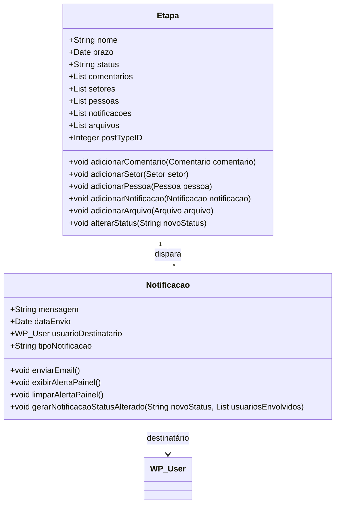
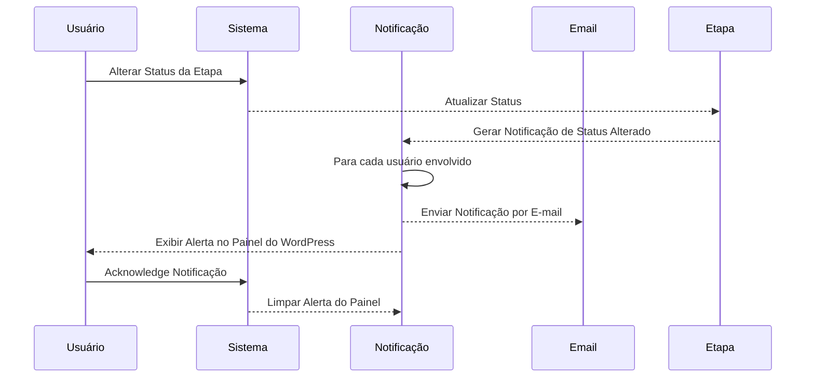
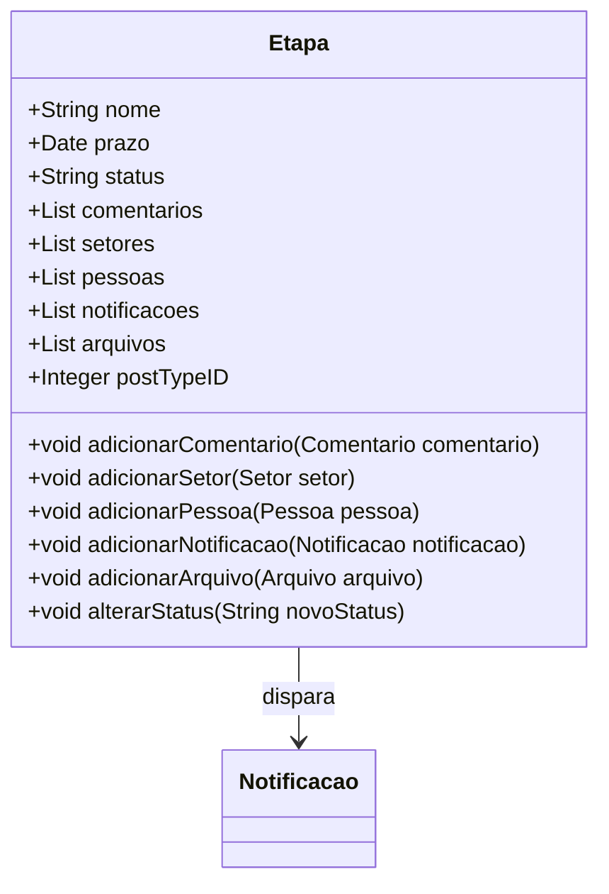

### Documento de Modelagem de Classe: Notificação

## Introdução

Este documento descreve a modelagem da classe `Notificação` dentro do sistema "Obatala", que será utilizada para gerenciar notificações relacionadas às etapas de processos curatoriais no WordPress. As notificações serão disparadas automaticamente sempre que o status de uma etapa mudar, notificando todos os envolvidos no processo de acordo com seu envolvimento na etapa.

---

### Descrição Geral

A classe `Notificação` é responsável por gerenciar e enviar alertas aos usuários envolvidos em uma etapa de um processo curatorial. As notificações serão disparadas por e-mail utilizando o `wp-mail` e também exibidas como alertas no painel do WordPress para os usuários envolvidos na etapa. Não será necessário armazenar um histórico de notificações, pois elas serão enviadas por e-mail.

### Propriedades da Classe

#### 1. Mensagem (Message)
- **Descrição**: O conteúdo da notificação.
- **Tipo**: String

#### 2. Data de Envio (Send Date)
- **Descrição**: A data e hora em que a notificação foi enviada.
- **Tipo**: Date

#### 3. Usuário Destinatário (Recipient User)
- **Descrição**: O usuário que receberá a notificação.
- **Tipo**: Objeto `WP_User`

#### 4. Tipo de Notificação (Notification Type)
- **Descrição**: O tipo de notificação (ex: Status Alterado, Novo Comentário).
- **Tipo**: String

### Métodos da Classe

#### 1. enviarEmail()
- **Descrição**: Envia a notificação por e-mail ao usuário destinatário utilizando `wp-mail`.
- **Retorno**: void

#### 2. exibirAlertaPainel()
- **Descrição**: Exibe a notificação como um alerta no painel do WordPress para o usuário destinatário.
- **Retorno**: void

#### 3. limparAlertaPainel()
- **Descrição**: Remove a notificação do painel do WordPress.
- **Retorno**: void

#### 4. gerarNotificacaoStatusAlterado(String $novoStatus, List<WP_User> $usuariosEnvolvidos)
- **Descrição**: Gera uma notificação quando o status da etapa é alterado.
- **Parâmetros**: 
    - `String $novoStatus` - O novo status da etapa.
    - `List<WP_User> $usuariosEnvolvidos` - A lista de usuários envolvidos na etapa.
- **Retorno**: void

---

### Diagramas

#### Diagrama de Classe

#### Diagrama de Sequência

### Explicação dos Métodos

#### 1. enviarEmail()
Este método utiliza a função `wp-mail` para enviar a notificação por e-mail ao usuário destinatário. Ele inclui a mensagem da notificação, a data de envio, e o tipo de notificação.

#### 2. exibirAlertaPainel()
Este método exibe a notificação como um alerta no painel do WordPress para o usuário destinatário. Ele garante que o usuário esteja ciente das atualizações ou mudanças nas etapas do processo.

#### 3. limparAlertaPainel()
Este método remove a notificação exibida no painel do WordPress. Ele é utilizado para limpar os alertas após o usuário ter reconhecido a notificação.

#### 4. gerarNotificacaoStatusAlterado(String $novoStatus, List<WP_User> $usuariosEnvolvidos)
Este método gera uma notificação sempre que o status de uma etapa é alterado. Ele cria a mensagem da notificação, define o tipo de notificação como "Status Alterado", e dispara a notificação para todos os usuários envolvidos na etapa.

### Implementação Automática de Notificações nas Etapas

Cada etapa será responsável por implementar automaticamente suas notificações. Sempre que o status de uma etapa mudar, todos os usuários envolvidos na etapa serão notificados do andamento. A classe `Etapa` terá um método `alterarStatus` que, ao ser chamado, atualizará o status da etapa e disparará as notificações para os usuários envolvidos.

### Explicação do Método `alterarStatus`

#### alterarStatus(String $novoStatus)
- **Descrição**: Atualiza o status da etapa e gera notificações para todos os usuários envolvidos.
- **Parâmetros**: 
    - `String $novoStatus` - O novo status da etapa.
- **Retorno**: void

Este método atualiza o status da etapa e chama o método `gerarNotificacaoStatusAlterado` da classe `Notificacao`, passando o novo status e a lista de usuários envolvidos na etapa. A notificação será então enviada por e-mail e exibida como um alerta no painel do WordPress para cada usuário.

---

### Conclusão

A classe `Notificação` é essencial para manter os usuários informados sobre as mudanças e atualizações nas etapas de um processo curatorial no sistema "Obatala". Este documento apresentou uma visão geral das propriedades e métodos da classe, assim como diagramas que explicam sua estrutura e sequência de utilização. Ao integrar notificações por e-mail e alertas no painel do WordPress, a classe `Notificação` assegura que todos os usuários envolvidos sejam devidamente informados, garantindo a transparência e eficiência na gestão dos processos curatoriais. A inclusão do método para limpar as notificações do painel assegura que os alertas sejam gerenciados de forma eficiente e não sobrecarreguem o usuário. A implementação automática de notificações em cada etapa simplifica a gestão e garante que todos os envolvidos sejam notificados sempre que o status de uma etapa mudar.

---