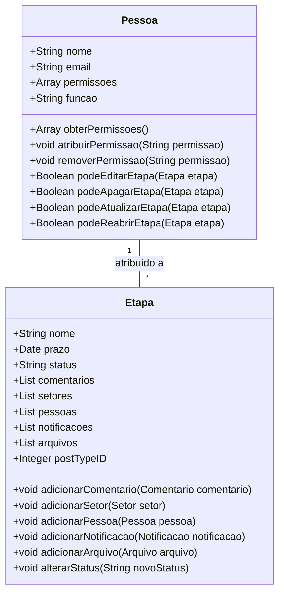
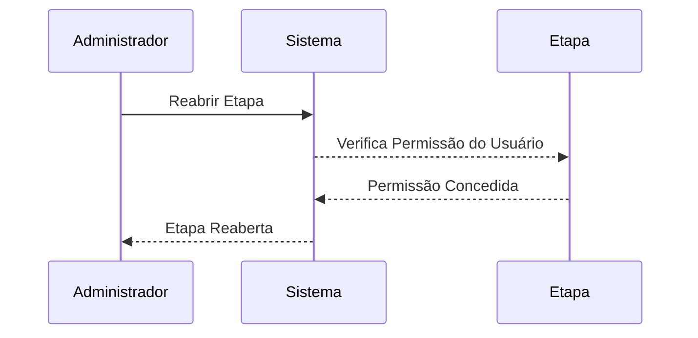

### Documento de Modelagem de Classe: Pessoa

---

## Introdução

Este documento descreve a modelagem da classe `Pessoa` dentro do sistema "Obatala", que será utilizada como uma abstração sobre os usuários do WordPress. A classe `Pessoa` possibilitará a extensão das permissões de usuários em coleções do Tainacan, permitindo um controle mais granular sobre quem pode editar, apagar ou atualizar determinada etapa de um processo.

---

### Descrição Geral

A classe `Pessoa` representa um usuário do WordPress que pode ser atribuído a uma etapa de um processo curatorial. As permissões de um usuário determinarão suas capacidades de interação com as etapas, como editar, apagar ou atualizar. Apenas administradores terão a permissão de reabrir uma etapa de um processo.

### Propriedades da Classe

#### 1. Nome (Name)
- **Descrição**: Nome da pessoa.
- **Tipo**: String

#### 2. Email (Email)
- **Descrição**: Email da pessoa.
- **Tipo**: String

#### 3. Permissões (Permissions)
- **Descrição**: Permissões do usuário sobre etapas e processos.
- **Tipo**: Array de Strings

#### 4. Função (Role)
- **Descrição**: Função do usuário no WordPress (ex: Administrador, Editor, Colaborador).
- **Tipo**: String

---

### Métodos da Classe

#### 1. obterPermissoes()
- **Descrição**: Retorna a lista de permissões do usuário.
- **Retorno**: Array de Strings

#### 2. atribuirPermissao(String $permissao)
- **Descrição**: Atribui uma nova permissão ao usuário.
- **Parâmetros**: `String $permissao`
- **Retorno**: void

#### 3. removerPermissao(String $permissao)
- **Descrição**: Remove uma permissão do usuário.
- **Parâmetros**: `String $permissao`
- **Retorno**: void

#### 4. podeEditarEtapa(Etapa $etapa)
- **Descrição**: Verifica se o usuário tem permissão para editar uma etapa.
- **Parâmetros**: `Etapa $etapa`
- **Retorno**: Boolean

#### 5. podeApagarEtapa(Etapa $etapa)
- **Descrição**: Verifica se o usuário tem permissão para apagar uma etapa.
- **Parâmetros**: `Etapa $etapa`
- **Retorno**: Boolean

#### 6. podeAtualizarEtapa(Etapa $etapa)
- **Descrição**: Verifica se o usuário tem permissão para atualizar uma etapa.
- **Parâmetros**: `Etapa $etapa`
- **Retorno**: Boolean

#### 7. podeReabrirEtapa(Etapa $etapa)
- **Descrição**: Verifica se o usuário tem permissão para reabrir uma etapa (apenas administradores).
- **Parâmetros**: `Etapa $etapa`
- **Retorno**: Boolean

---

### Diagramas

#### Diagrama de Classe

### Explicação do Diagrama

1. **Pessoa**: Representa um usuário do WordPress, com propriedades como nome, email, permissões e função. A classe inclui métodos para gerenciar as permissões do usuário e verificar suas capacidades de interação com as etapas do processo.

2. **Etapa**: Uma fase específica dentro de um processo. Cada etapa pode conter comentários, setores, pessoas, notificações e arquivos.

3. **Relacionamento**:
    - **Pessoa** pode ser atribuída a múltiplas **Etapas**. As permissões de uma pessoa determinarão suas capacidades de editar, apagar, atualizar e reabrir etapas.

#### Diagrama de Sequência

### Explicação dos Métodos

#### 1. obterPermissoes()
Este método retorna a lista de permissões atribuídas ao usuário, permitindo verificar quais ações o usuário pode realizar.

#### 2. atribuirPermissao(String $permissao)
Este método atribui uma nova permissão ao usuário, adicionando a capacidade de realizar ações adicionais sobre as etapas.

#### 3. removerPermissao(String $permissao)
Este método remove uma permissão do usuário, restringindo suas capacidades de interação com as etapas.

#### 4. podeEditarEtapa(Etapa $etapa)
Este método verifica se o usuário tem permissão para editar uma etapa específica.

#### 5. podeApagarEtapa(Etapa $etapa)
Este método verifica se o usuário tem permissão para apagar uma etapa específica.

#### 6. podeAtualizarEtapa(Etapa $etapa)
Este método verifica se o usuário tem permissão para atualizar uma etapa específica.

#### 7. podeReabrirEtapa(Etapa $etapa)
Este método verifica se o usuário tem permissão para reabrir uma etapa. Apenas administradores terão essa permissão.

---

### Conclusão

A classe `Pessoa`, implementada como uma abstração sobre os usuários do WordPress, é fundamental para a gestão de permissões e atribuições dentro de um processo curatorial no sistema "Obatala". Este documento apresentou uma visão geral das propriedades e métodos da classe, assim como diagramas que explicam sua estrutura e sequência de utilização. Ao utilizar a classe `Pessoa`, o sistema pode controlar de forma granular as permissões dos usuários sobre as etapas, garantindo um fluxo de trabalho seguro e eficiente.

---