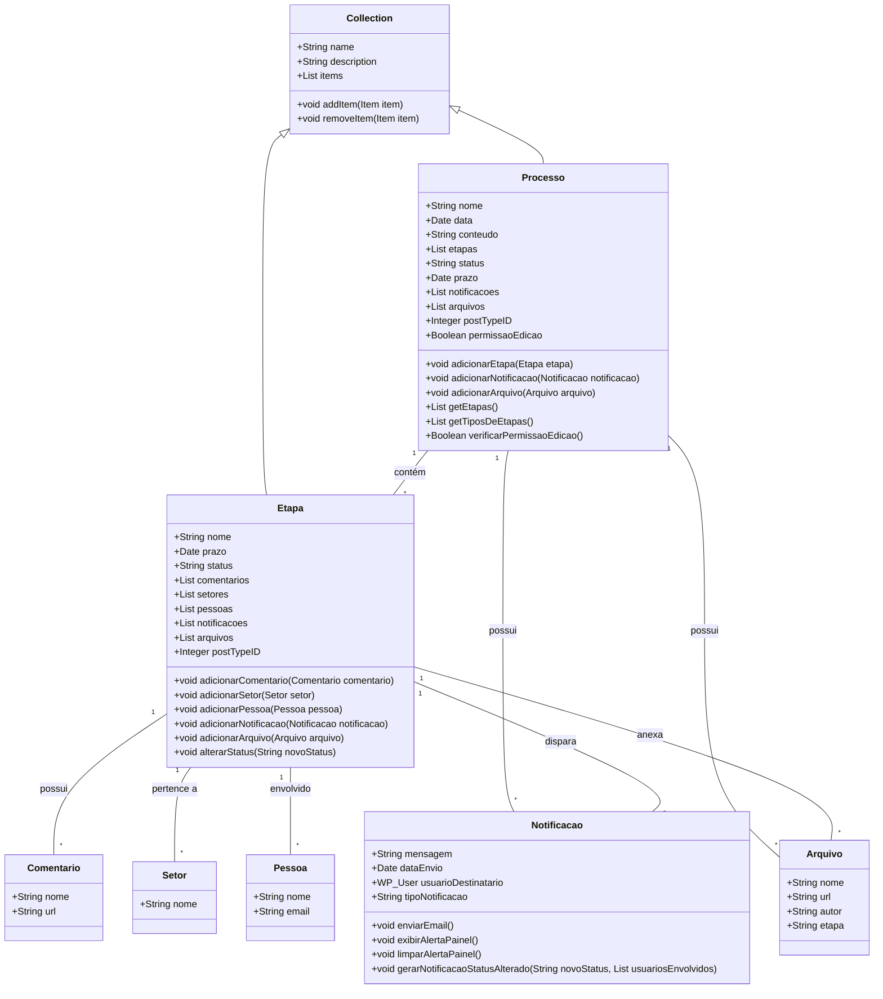
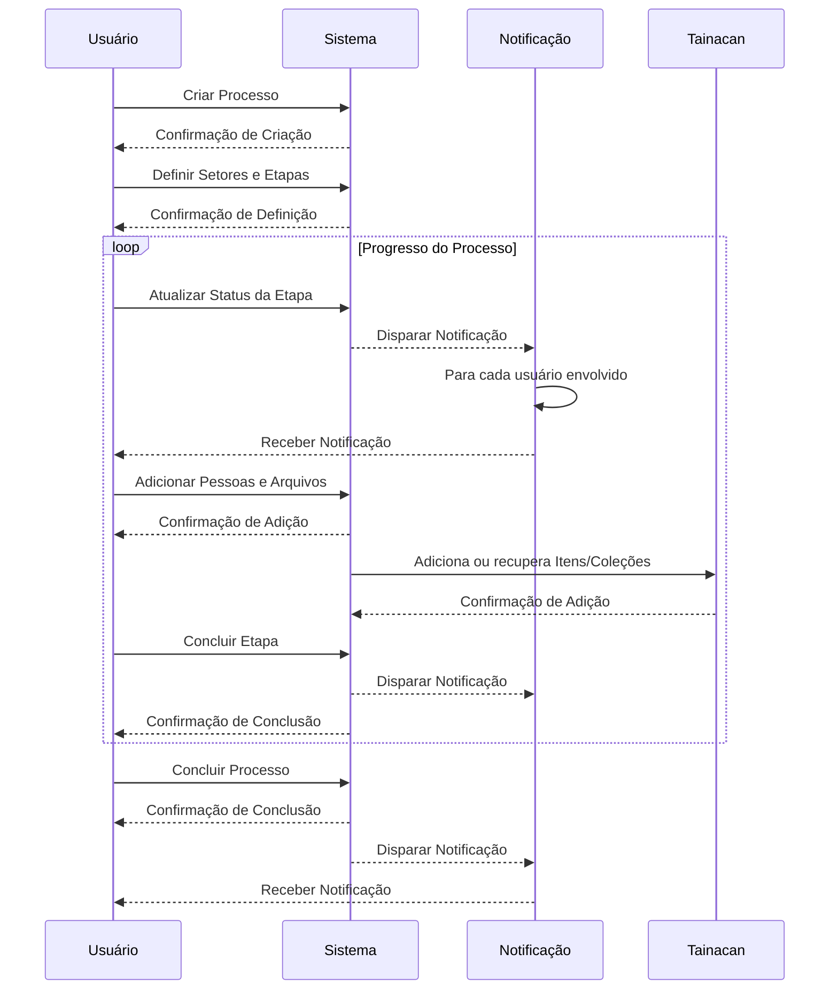

### Documento de Modelagem de Classe: Processo

---

## Introdução

Este documento descreve a modelagem da classe `Processo` dentro do sistema "Obatala", que será utilizado para gerenciar processos curatoriais no WordPress. A classe `Processo` estenderá a classe `Collection` do Tainacan, permitindo a criação de um tipo de post customizado e a integração com as funcionalidades avançadas de gestão de coleções do Tainacan.

---

### Descrição Geral

A classe `Processo` representa a entidade principal no sistema "Obatala". Ela é responsável por gerenciar todos os aspectos de um processo curatorial, incluindo suas etapas, notificações e arquivos anexados. A classe estende a `Collection` do Tainacan, aproveitando suas capacidades de gestão de coleções digitais.

!!! Nota Importante
    Como a classe `Processo` estende a classe `Collection` do Tainacan, ela herda todos os métodos e funcionalidades da classe `Collection`. Isso inclui capacidades avançadas de interação com objetos do tipo `WP_POST`, gerenciamento de metadados e manipulação de itens dentro de uma coleção. Além disso, a classe `Processo` terá um ID relacionado ao tipo de post, permitindo uma integração fluida e eficiente com o WordPress.

### Propriedades da Classe

#### 1. Nome (Title)
- **Descrição**: Identificação única do processo.
- **Tipo**: String

#### 2. Data (Date)
- **Descrição**: Data de criação ou início do processo.
- **Tipo**: Date

#### 3. Conteúdo (Content)
- **Descrição**: Descrição detalhada do processo.
- **Tipo**: String

#### 4. Etapas (Steps)
- **Descrição**: Fases ou passos do processo, incluindo comentários, setores, pessoas, status, itens, coleções e notificações associadas.
- **Tipo**: Array de objetos `Etapa`

#### 5. Status
- **Descrição**: Estado atual do processo (ex: Iniciado, Em Progresso, Concluído).
- **Tipo**: String

#### 6. Prazo (Deadline)
- **Descrição**: Data limite para a conclusão do processo/etapa.
- **Tipo**: Date

#### 7. Notificações (Notifications)
- **Descrição**: Alertas ou avisos relacionados ao processo.
- **Tipo**: Array de objetos `Notificacao`

#### 8. Arquivos (Attachments)
- **Descrição**: Documentos ou arquivos relacionados ao processo.
- **Tipo**: Array de objetos `Arquivo`

#### 9. ID do Tipo de Post (Post Type ID)
- **Descrição**: ID relacionado ao tipo de post, permitindo a integração com o WordPress.
- **Tipo**: Integer

#### 10. Permissões de Edição (Edit Permissions)
- **Descrição**: Define se o processo pode ser editado com base em seu status.
- **Tipo**: Boolean

---

### Métodos da Classe

#### 1. adicionarEtapa(Etapa $etapa)
- **Descrição**: Adiciona uma nova etapa ao processo.
- **Parâmetros**: `Etapa $etapa`
- **Retorno**: void

#### 2. adicionarNotificacao(Notificacao $notificacao)
- **Descrição**: Adiciona uma nova notificação ao processo.
- **Parâmetros**: `Notificacao $notificacao`
- **Retorno**: void

#### 3. adicionarArquivo(Arquivo $arquivo)
- **Descrição**: Adiciona um novo arquivo ao processo.
- **Parâmetros**: `Arquivo $arquivo`
- **Retorno**: void

#### 4. getEtapas()
- **Descrição**: Retorna a lista de etapas do processo.
- **Retorno**: Array de objetos `Etapa`

#### 5. getTiposDeEtapas()
- **Descrição**: Retorna a lista de tipos de etapas disponíveis.
- **Retorno**: Array de Strings

#### 6. verificarPermissaoEdicao()
- **Descrição**: Verifica se o processo pode ser editado com base em seu status.
- **Retorno**: Boolean

---

### Diagramas

#### Diagrama de Classe

!!! nota
    Nesta abstração adicionamos a classe etapa para demonstrar que ela interage com o processo, apesar de interdependentes o processo deve ser implementado individualmente.

#### Diagrama de Sequência

---

### Conclusão

A classe `Processo`, estendendo a classe `Collection` do Tainacan, é fundamental para a gestão de processos curatoriais no sistema "Obatala". Este documento apresentou uma visão geral das propriedades e métodos da classe, assim como diagramas que explicam sua estrutura e sequência de utilização. Ao herdar os métodos e funcionalidades da classe `Collection`, a classe `Processo` se beneficia das capacidades avançadas de interação com objetos do tipo `POST`, gerenciamento de metadados e manipulação de itens dentro de uma coleção. Além disso, a associação de um ID relacionado ao tipo de post garante uma integração eficiente com o WordPress.

Cada processo deverá implementar um método para retornar a lista de etapas e tipos de etapas, garantindo uma gestão completa e eficiente das fases do processo curatorial. A propriedade de permissões de edição com base no status do processo assegura que apenas processos em certos estados podem ser editados, mantendo a integridade e o controle do fluxo do processo.

---