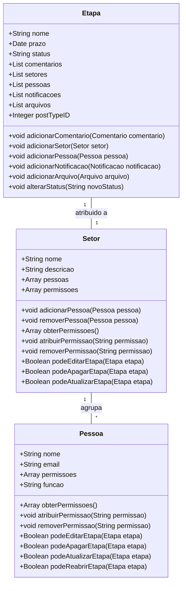
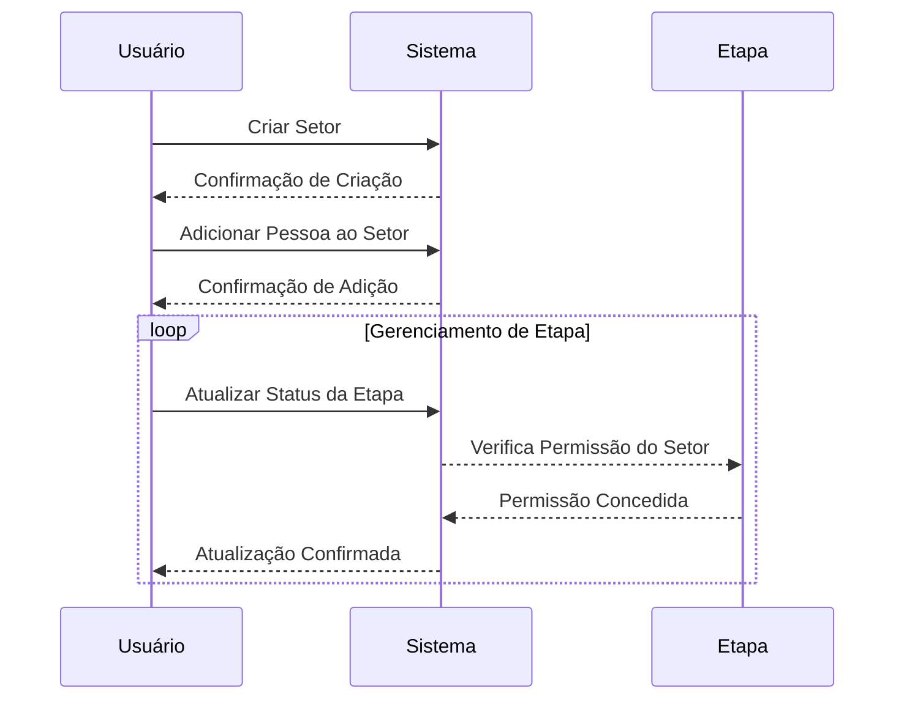

### Documento de Modelagem de Classe: Setor

---

## Introdução

Este documento descreve a modelagem da classe `Setor` dentro do sistema "Obatala", que será utilizada para gerenciar os setores envolvidos nas etapas dos processos curatoriais no WordPress. A classe `Setor` representará um tipo de função adicional, agrupando diversas pessoas e definindo permissões de edição, exclusão e atualização de informações em uma etapa.

---

### Descrição Geral

A classe `Setor` agrupa pessoas que terão permissões específicas para interagir com as etapas de um processo curatorial. Cada etapa será atribuída a um setor, e o sistema permitirá a criação de múltiplos setores, com cada setor participando de uma etapa específica.

### Propriedades da Classe

#### 1. Nome (Name)
- **Descrição**: Nome do setor.
- **Tipo**: String

#### 2. Descrição (Description)
- **Descrição**: Descrição do setor.
- **Tipo**: String

#### 3. Pessoas (People)
- **Descrição**: Lista de pessoas que fazem parte do setor.
- **Tipo**: Array de objetos `Pessoa`

#### 4. Permissões (Permissions)
- **Descrição**: Permissões atribuídas ao setor.
- **Tipo**: Array de Strings

---

### Métodos da Classe

#### 1. adicionarPessoa(Pessoa $pessoa)
- **Descrição**: Adiciona uma nova pessoa ao setor.
- **Parâmetros**: `Pessoa $pessoa`
- **Retorno**: void

#### 2. removerPessoa(Pessoa $pessoa)
- **Descrição**: Remove uma pessoa do setor.
- **Parâmetros**: `Pessoa $pessoa`
- **Retorno**: void

#### 3. obterPermissoes()
- **Descrição**: Retorna a lista de permissões atribuídas ao setor.
- **Retorno**: Array de Strings

#### 4. atribuirPermissao(String $permissao)
- **Descrição**: Atribui uma nova permissão ao setor.
- **Parâmetros**: `String $permissao`
- **Retorno**: void

#### 5. removerPermissao(String $permissao)
- **Descrição**: Remove uma permissão do setor.
- **Parâmetros**: `String $permissao`
- **Retorno**: void

#### 6. podeEditarEtapa(Etapa $etapa)
- **Descrição**: Verifica se o setor tem permissão para editar uma etapa.
- **Parâmetros**: `Etapa $etapa`
- **Retorno**: Boolean

#### 7. podeApagarEtapa(Etapa $etapa)
- **Descrição**: Verifica se o setor tem permissão para apagar uma etapa.
- **Parâmetros**: `Etapa $etapa`
- **Retorno**: Boolean

#### 8. podeAtualizarEtapa(Etapa $etapa)
- **Descrição**: Verifica se o setor tem permissão para atualizar uma etapa.
- **Parâmetros**: `Etapa $etapa`
- **Retorno**: Boolean

---

### Diagramas

#### Diagrama de Classe

### Explicação do Diagrama

1. **Setor**: Representa um grupo de pessoas com permissões específicas para interagir com as etapas de um processo. Cada setor tem um nome, descrição, lista de pessoas e permissões.

2. **Pessoa**: Representa um usuário do WordPress, com propriedades como nome, email, permissões e função. A classe inclui métodos para gerenciar as permissões do usuário e verificar suas capacidades de interação com as etapas do processo.

3. **Etapa**: Uma fase específica dentro de um processo. Cada etapa pode conter comentários, setores, pessoas, notificações e arquivos. Cada etapa é atribuída a um único setor.

4. **Relacionamentos**:
    - **Setor** agrupa múltiplas **Pessoas**.
    - **Etapa** é atribuída a um único **Setor**.

#### Diagrama de Sequência

### Explicação dos Métodos

#### 1. adicionarPessoa(Pessoa $pessoa)
Este método adiciona uma nova pessoa ao setor, permitindo que essa pessoa tenha as permissões atribuídas ao setor.

#### 2. removerPessoa(Pessoa $pessoa)
Este método remove uma pessoa do setor, revogando suas permissões relacionadas ao setor.

#### 3. obterPermissoes()
Este método retorna a lista de permissões atribuídas ao setor, permitindo verificar quais ações o setor pode realizar.

#### 4. atribuirPermissao(String $permissao)
Este método atribui uma nova permissão ao setor, adicionando a capacidade de realizar ações adicionais sobre as etapas.

#### 5. removerPermissao(String $permissao)
Este método remove uma permissão do setor, restringindo suas capacidades de interação com as etapas.

#### 6. podeEditarEtapa(Etapa $etapa)
Este método verifica se o setor tem permissão para editar uma etapa específica.

#### 7. podeApagarEtapa(Etapa $etapa)
Este método verifica se o setor tem permissão para apagar uma etapa específica.

#### 8. podeAtualizarEtapa(Etapa $etapa)
Este método verifica se o setor tem permissão para atualizar uma etapa específica.

### Conclusão

A classe `Setor`, implementada como um tipo de função adicional no WordPress, é fundamental para a gestão de grupos de pessoas e suas permissões nas etapas de um processo curatorial no sistema "Obatala". Este documento apresentou uma visão geral das propriedades e métodos da classe, assim como diagramas que explicam sua estrutura e sequência de utilização. Ao utilizar a classe `Setor`, o sistema pode controlar de forma granular as permissões dos grupos de usuários sobre as etapas, garantindo um fluxo de trabalho seguro e eficiente. Cada etapa será atribuída a um setor específico, e as permissões do setor determinarão as capacidades de interação dos usuários com a etapa.

---