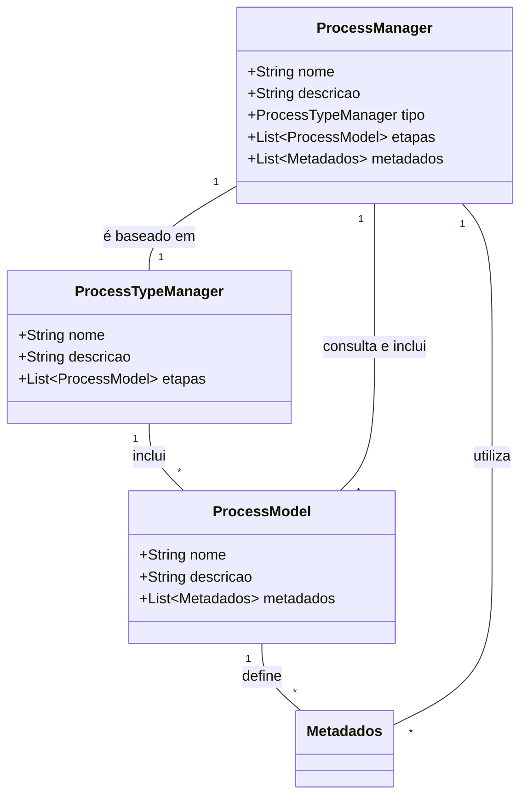

# Utilização dos Custom Post Types no Plugin Obatala

No plugin Obatala, utilizamos três tipos de post personalizados (Custom Post Types) para gerenciar processos curatoriais e suas etapas: **ProcessManager**, **ProcessTypeManager** e **ProcessModel**. Cada tipo de post tem um papel específico na configuração e operação do sistema de gestão de processos.

## Descrição dos Custom Post Types

### 1. ProcessModel

- **Função**: Serve como modelo para as etapas de um processo.
- **Utilização**: Armazena os metadados usados para criar campos personalizados em cada etapa. Esses campos são exibidos na interface do processo para interação dos usuários.
- **Estrutura**: Inclui campos para o título e a descrição de cada etapa, além dos dados de fluxo (`flowData`), que especificam a sequência e conexão entre as etapas.

### 2. ProcessTypeManager

- **Função**: Define o modelo ou tipo de processo.
- **Utilização**: Armazena o título do tipo de processo, a descrição e uma lista ordenada de etapas (steps) que compõem o processo. Esse tipo permite gerenciar diferentes modelos de processos, cada um com suas etapas específicas.
- **Estrutura**: Contém campos para o título e a descrição do processo, além de uma referência às etapas (`ProcessModel`) que definem a sequência do processo.

### 3. ProcessManager

- **Função**: Representa a instância real de um processo no sistema.
- **Utilização**: Quando um novo processo é criado, ele é baseado em um tipo (`ProcessTypeManager`). Durante a criação, ele consulta o `ProcessTypeManager` e o `ProcessModel` associado para gravar os metadados necessários. Esses metadados são usados para criar e interagir com o processo.
- **Estrutura**: Inclui campos para o título e descrição do processo, o tipo de processo, as etapas e os metadados necessários para a interação.

## Fluxo de Trabalho dos Custom Post Types

1. **Definição dos Modelos**:          

    - Cria-se um `ProcessModel` para cada etapa que pode fazer parte de um processo.
    - Define-se os metadados que descrevem os campos personalizados a serem exibidos na interface do processo.

1. **Criação do Tipo de Processo**:     

    - Cria-se um `ProcessTypeManager` para definir um modelo de processo.
    - Inclui-se uma lista ordenada de `ProcessModel`, especificando a sequência de etapas que o processo seguirá.

1. **Instanciação de um Processo**:       
    - Cria-se um `ProcessManager` baseado em um `ProcessTypeManager`.
    - O `ProcessManager` consulta o `ProcessTypeManager` e as etapas no `ProcessModel` associado para configurar os metadados e campos personalizados.
    - Esses metadados são gravados no `ProcessManager` para criar uma interface interativa onde os usuários podem gerenciar e interagir com cada etapa.

## Diagrama do Processo

## Conclusão
O plugin Obatala utiliza uma estrutura organizada de Custom Post Types para gerenciar processos curatoriais, etapas e tipos de processos. Essa abordagem permite uma configuração flexível e a integração de metadados personalizados, facilitando a criação de interfaces interativas para a gestão de processos dentro do WordPress.
