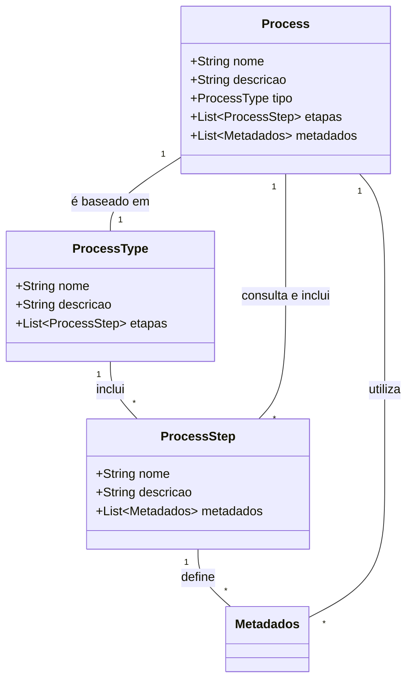

# Utilização dos Custom Post Types no Plugin Obatala

No plugin Obatala, utilizamos três tipos de post (custom post types) para gerenciar processos curatoriais e suas etapas: **Process**, **ProcessType** e **ProcessStep**. Cada um desses tipos de post tem um papel específico na configuração e operação do sistema de gestão de processos.

### Descrição dos Custom Post Types

#### 1. ProcessStep

- **Função**: Serve como modelo (mockup) para as etapas de um processo.
- **Utilização**: Armazena os metadados que serão usados para criar campos personalizados em cada etapa do processo. Esses campos personalizados são exibidos na interface do processo para que os usuários possam interagir.
- **Estrutura**: Inclui campos para definir o nome da etapa, a descrição, e os metadados associados que especificam o tipo de campo que será exibido na interface do processo.

#### 2. ProcessType

- **Função**: Serve como modelo (mockup) para tipos de processos.
- **Utilização**: Armazena o nome do tipo de processo, uma descrição detalhada e uma lista ordenada de steps (etapas) que compõem o processo.
- **Estrutura**: Contém campos para o nome do processo, a descrição da sua utilidade, e uma referência às etapas (`ProcessStep`) que definem a sequência do processo.

#### 3. Process

- **Função**: Representa a instância real de um processo na aplicação.
- **Utilização**: Quando um novo processo é criado, ele é de um determinado tipo (`ProcessType`). Durante a criação, ele consulta o `ProcessType` e os `ProcessStep` associados para gravar os metadados necessários. Esses metadados são usados para criar e interagir com o processo. 
- **Estrutura**: Inclui campos para o título do processo, uma descrição geral, o tipo do processo, as etapas, e os metadados necessários para a interação.

### Fluxo de Trabalho dos Custom Post Types

1. **Definição dos Steps (Etapas)**:
      - Cria-se um `ProcessStep` para cada etapa que pode fazer parte de um processo.
      - Define-se os metadados que descrevem os campos personalizados a serem exibidos na interface do processo.

2. **Criação do Tipo de Processo**:
      - Cria-se um `ProcessType` para definir um modelo de processo.
      - Inclui-se uma lista ordenada de `ProcessStep`, especificando a sequência de etapas que o processo seguirá.

3. **Instanciação de um Processo**:
      - Cria-se um `Process` baseado em um `ProcessType`.
      - O `Process` consulta o `ProcessType` e os `ProcessStep` associados para configurar os metadados e campos personalizados.
      - Esses metadados são gravados no `Process` para criar uma interface interativa onde os usuários podem gerenciar e interagir com cada etapa.

### Diagrama do Processo

### Conclusão

O plugin Obatala utiliza uma estrutura organizada de custom post types para gerenciar processos curatoriais, etapas e tipos de processos. Essa abordagem permite uma configuração flexível e a integração de metadados personalizados, facilitando a criação de interfaces interativas para a gestão de processos dentro do WordPress.
