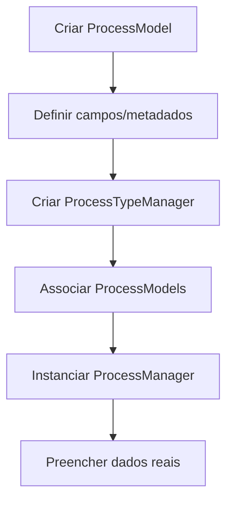
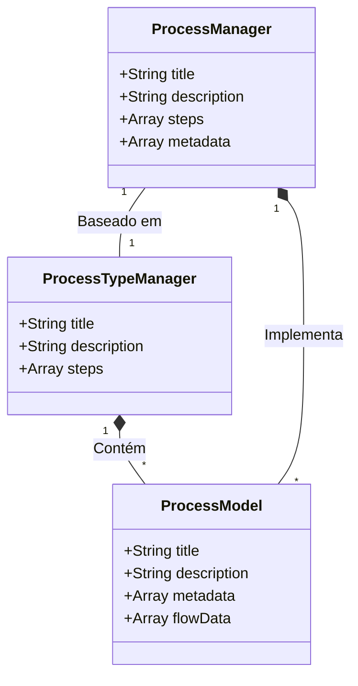

# 📌 Utilização dos Custom Post Types no Plugin Obatala

## 🔍 Visão Geral
O plugin Obatala utiliza três Custom Post Types principais para gestão de processos curatoriais:

| CPT               | Função Principal                          |
|-------------------|------------------------------------------|
| `ProcessModel`    | Modelos de etapas do processo            |
| `ProcessTypeManager` | Tipos/modelos de processos              |
| `ProcessManager`  | Instâncias reais de processos            |

## 🏗️ Descrição dos CPTs

### 1. ProcessModel
**Função**: Modelo base para etapas de processos

**Características**:
- Armazena metadados para campos personalizados
- Define a estrutura de cada etapa
- Contém:
  ```php
  'title' => 'Nome da Etapa',
  'description' => 'Descrição detalhada',
  'flowData' => 'Dados de conexão entre etapas'
  ```
### 2. ProcessTypeManager
**Função**: Template completo de processos

Estrutura:

```php
[
    'title' => 'Tipo de Processo',
    'description' => 'Descrição do fluxo',
    'steps' => ['array_de_etapas']
]
```

### 3. ProcessManager
**Função**: Instância executável de processos

**Componentes**:

- Herda estrutura do ProcessTypeManager

- Armazena dados reais de execução

- Inclui metadados dinâmicos

### 🔄 Fluxo de Trabalho


```mermaid
flowchart TD
    A[Criar ProcessModel] --> B[Definir campos/metadados]
    B --> C[Criar ProcessTypeManager]
    C --> D[Associar ProcessModels]
    D --> E[Instanciar ProcessManager]
    E --> F[Preencher dados reais]
```

### 🧩 Diagrama de Relacionamentos


```mermaid
classDiagram
    class ProcessModel {
        +String title
        +String description
        +Array metadata
        +Array flowData
    }
    
    class ProcessTypeManager {
        +String title
        +String description
        +Array steps
    }
    
    class ProcessManager {
        +String title
        +String description
        +Array steps
        +Array metadata
    }
    
    ProcessTypeManager "1" *-- "*" ProcessModel : Contém
    ProcessManager "1" -- "1" ProcessTypeManager : Baseado em
    ProcessManager "1" *-- "*" ProcessModel : Implementa
```
### 💡 Conclusão
Esta arquitetura proporciona:

- ✅ Flexibilidade: Modelos reutilizáveis
- ✅ Consistência: Estrutura padronizada
- ✅ Extensibilidade: Fácil adição de novos tipos
- ✅ Performance: Consultas otimizadas via metadados