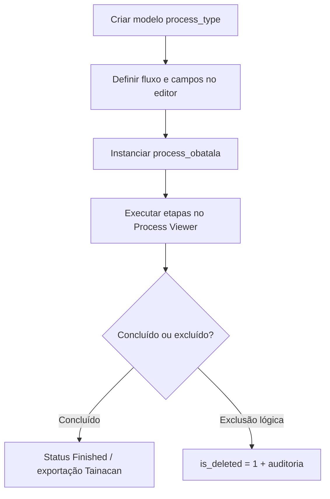
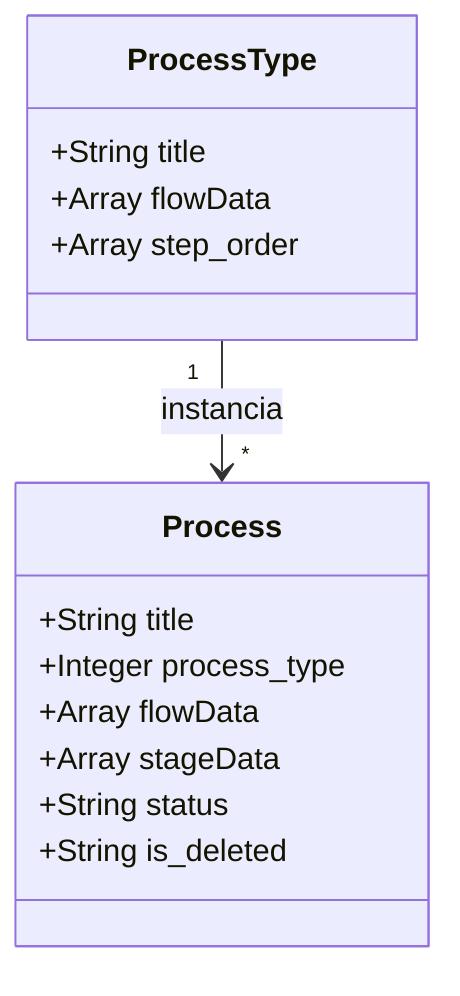

# 📌 Custom Post Types no Plugin Obatala

## 🔍 Visão Geral

O plugin Obatala utiliza **dois Custom Post Types** registrados em `classes/Entities/`:

| Slug REST / WP | Classe PHP | Função |
|----------------|------------|--------|
| `process_type` | `ProcessType` | **Modelo** de processo (fluxo, etapas, campos) |
| `process_obatala` | `Process` | **Instância** em execução de um processo |

Setores/grupos **não** são CPT: ficam em metadados e tabelas gerenciadas por `Sector` e `SectorApi`.

## 🏗️ `process_type` (modelo)

Define a estrutura reutilizável de um processo:

- Título e descrição do modelo
- `flowData`: nós (etapas), arestas (conexões) e campos dinâmicos por etapa
- `step_order`, status ativo/inativo
- Configuração de exportação Tainacan (mappers)

Editado na tela **Modelos** e no **editor de fluxo** (`process-type-editor`).

## 🏗️ `process_obatala` (instância)

Representa um processo real em andamento ou concluído:

- Herda o `flowData` do modelo associado (`process_type`)
- `stageData`: valores preenchidos por etapa
- `current_stage`, `status`, `access_level`
- Metadados de exclusão lógica: `is_deleted`, `deleted_at`, `deleted_by`, `deleted_by_name`

Gerenciado na tela **Processos** e no **visualizador** (`process-viewer`). Consulte [Gestão de processos](processos/gestao-processos.md) para exclusão lógica e PDF.

## 🔄 Fluxo de Trabalho

```mermaid
flowchart TD
    A[Criar modelo process_type] --> B[Definir fluxo e campos no editor]
    B --> C[Instanciar process_obatala]
    C --> D[Executar etapas no Process Viewer]
    D --> E{Concluído ou excluído?}
    E -->|Concluído| F[Status Finished / exportação Tainacan]
    E -->|Exclusão lógica| G[is_deleted = 1 + auditoria]
```

## 🧩 Diagrama de Relacionamentos

```mermaid
classDiagram
    class ProcessType {
        +String title
        +Array flowData
        +Array step_order
    }

    class Process {
        +String title
        +Integer process_type
        +Array flowData
        +Array stageData
        +String status
        +String is_deleted
    }

    ProcessType "1" --> "*" Process : instancia
```

## 💡 Conclusão

Esta arquitetura proporciona:

- **Flexibilidade**: modelos reutilizáveis (`process_type`)
- **Consistência**: mesma estrutura de campos em todas as instâncias
- **Rastreabilidade**: dados de execução e auditoria de exclusão em `process_obatala`
- **Performance**: consultas via `post_meta` e REST API customizada (`CustomPostTypeApi`, `ProcessApi`)
